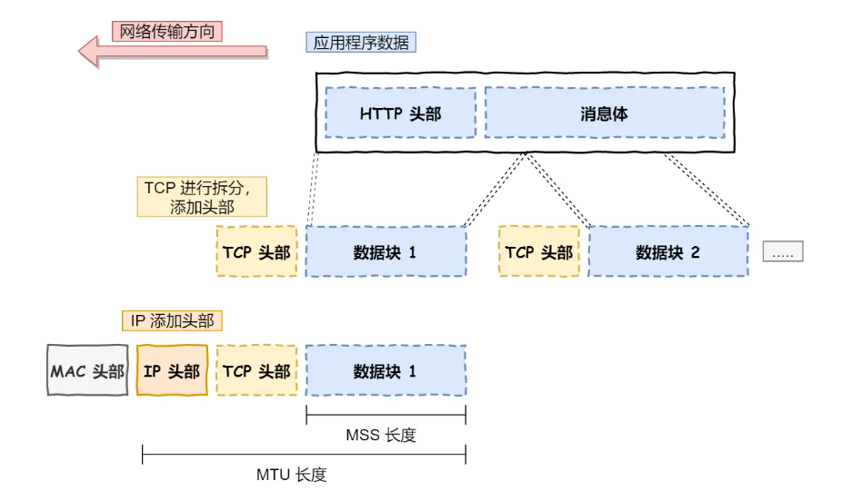

网络接口层传输单位：**帧**（frame）
网络层传输单位：**包**（packet）
传输层传输单位：**段**（segment）
应用层传输单位：**报文**（message）

## 应用层

- 日常生活中使用的应用软件都是在应用层实现
- 应用层只专注为用户提供应用功能，无需关注数据如何传输
- HTTP、FTP、Telnet、DNS、SMTP

应用层协议的核心作用：**定义应用程序之间的通信规则**，例如如何请求网页、传输文件或发送邮件，它们是直接面向用户和应用程序的接口

与应用层的关系：
- 应用层协议需要依赖传输层提供的服务来实现数据传递
- HTTP使用TCP实现可靠传输
- DNS使用UDP 低延迟

## 传输层

- 应用层的数据包会传给传输层
- 传输层为应用层提供网络支持
- 传输层有两个传输协议 ：TCP、UDP
- 传输层为应用层提供端到端的通信通道
- TCP 有流量控制、超时重传、拥塞控制，保证数据包能可靠地传输给对方
- UDP只负责发送数据包，不保证数据包能否抵达

### TCP段
传输层的数据包大小超过MSS（TCP最大报文段长度），就需要将数据包分块。
> 数据包分块的目的：即使中途有一个分块丢失或损坏，只需要发送这一个分块，不用发送整个数据包。

将每个分块称为一个TCP段

### 端口

- 当传输层负责把数据包传给应用层时
- 一台设备上有多个应用在接受或传输数据
- 需要用一个编号来区分应用
- 这个编号就是端口
常见的端口：
- Web服务器：80端口
- 远程登陆服务器：22端口

> 传输层的报文中携带端口号，因此接收方可以识别出报文是发送给哪个应用的。

- 传输层并不负责将数据从一个设备传输到另一个设备
- 传输层只需要服务好应用即可

## 网络层

- 网络层负责将数据从一个设备传输到另一个设备
- 网络层最常使用的协议是：**IP协议**

### IP协议
- IP协议会将传输层的报文作为数据部分，再加上IP头部组成IP报文
- 如果IP报文超过MTU（以太网一般为1500字节）就会再次分片
- 寻址：采用IP地址寻址，先匹配到相同的网络号（表示要找到同一子网），然后找到对应主机

> IP协议寻址：告诉下一个目的地的方向
> 路由：根据下一个目的地选择路径

## 网络接口层

- 网络接口层在IP头部前面加上MAC头部，并封装成数据帧
- 为网络层提供【链路级别】传输的服务，负责在以太网上发送原始数据包，并通过MAC地址标识网络上的设备。

### 以太网

- 以太网是一种在局域网内，把附近的设备连接起来，使它们之间可以进行通讯的技术
- 电脑上的以太网接口、wifi就扣、以太网交换机、网线等都是以太网的组成部分
- 以太网在判断网络包目的地不是根据IP，而是MAC地址
- MAC地址是以太网使用的头部，它包含接收方和发送方的MAC地址等信息，可以通过ARP协议获取对方MAC地址

## 一些疑问

- **IP地址的作用**：
    - **逻辑寻址**：在互联网中唯一标识设备（如IPv4的32位地址）。
      
    - **跨网络路由**：IP地址是分层的（网络号+主机号），路由器根据IP地址决定如何将数据包转发到目标网络。

- **MAC地址的作用**：
    - **物理寻址**：在局域网（如以太网）中唯一标识设备（如48位地址）。
      
    - **本地链路传输**：数据在同一个局域网内通过MAC地址直接传递（如ARP协议解析IP到MAC）。
    
- **协作示例**：  
    当数据从北京发往纽约时，源/目的IP地址始终不变（全局寻址），但每一跳的源/目的MAC地址会变化（本地链路传输）。

- **以太网是什么**：  
    以太网是**数据链路层（L2）的协议**，定义局域网内设备如何通过物理介质（如网线、WiFi）通信，使用MAC地址寻址。
    
- **为什么必须用MAC地址**：
    - 以太网的帧结构（前导码+目的MAC+源MAC+类型+数据+FCS）依赖MAC地址在链路层直接寻址。
      
    - 路由器在转发数据时，会**修改帧的MAC地址**（下一跳路由器或目标设备的MAC），但保持IP地址不变。
    
- **路由器的角色**：
    - 路由器同时具有**IP地址（网络层）和MAC地址（数据链路层）**。
      
    - 当数据包到达路由器时：
      
        1. 剥离数据链路层帧头（MAC地址完成使命）。
           
        2. 根据IP地址查询路由表，确定下一跳。
           
        3. 重新封装新的帧头（下一跳MAC地址）。

