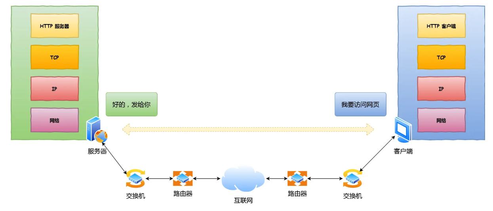
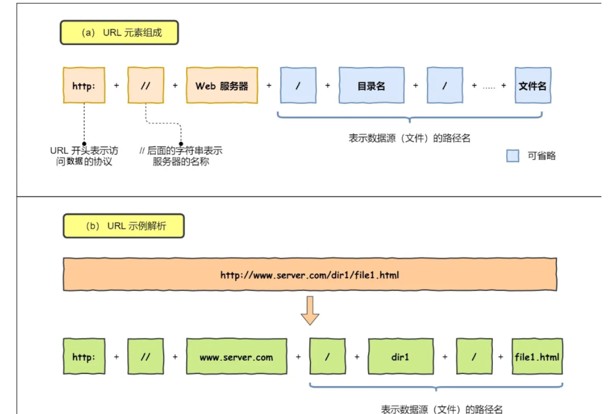
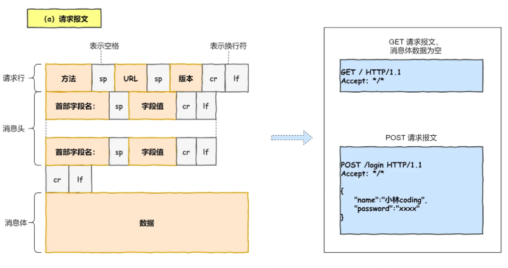
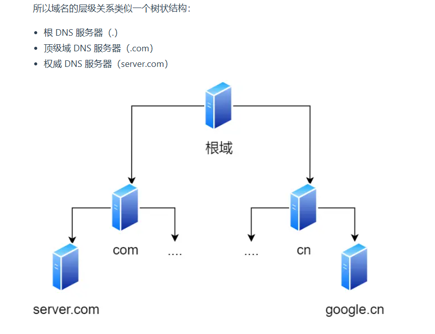

问题：「当键入网址后，到网页显示，其间发生了什么」

## 浏览器解析URL

- 解析URL后确定 **web服务器和文件名**

## 生成HTTP请求消息

### DNS服务器

- 向服务器发送消息之前，需要查询服务器域名对应的IP地址
- DNS服务器：保存了web服务器域名与IP的对应关系
- 当客户端发送一个DNS请求，发送给本地DNS服务器
- 本地DNS服务器缓存中有就返回IP地址，没有的话会去问根域名服务器
- 根域名服务器不直接用于域名解析，但可以指路
- 发现域名后缀是.com，根域名服务器会给出.com顶级域名服务器地址
- 顶级域名服务器能给出 `www.server.com`区域的权威DNS服务器
- 本地DNS询问权威DNS服务器得到IP地址
- 本地DNS将IP地址返回客户端，客户端和目标建立连接

