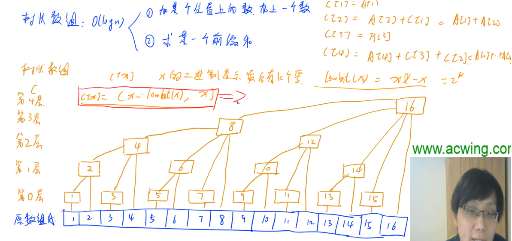
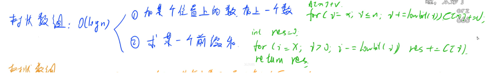
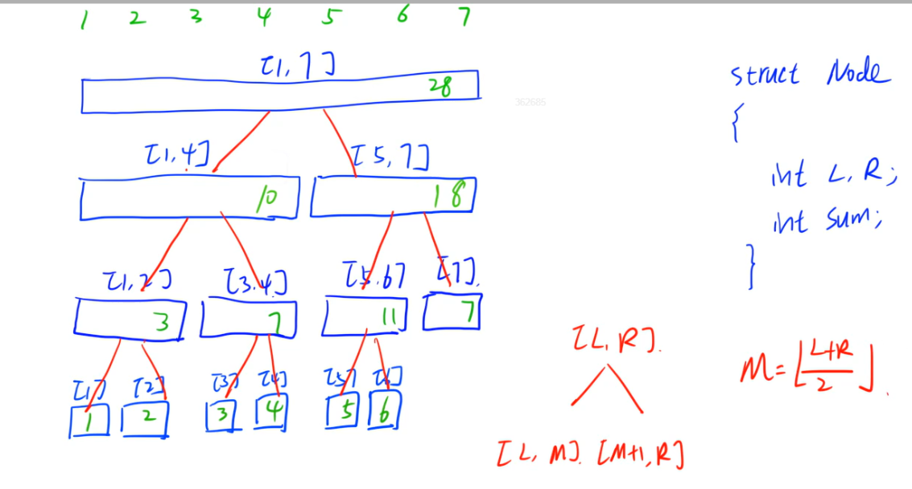
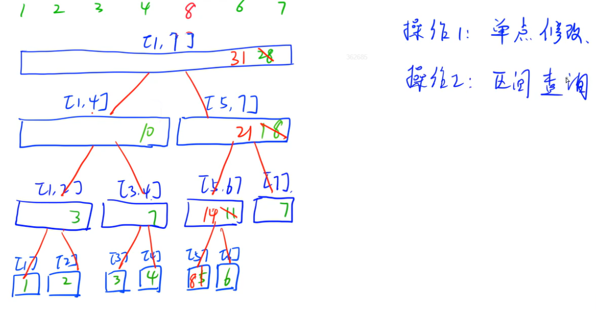
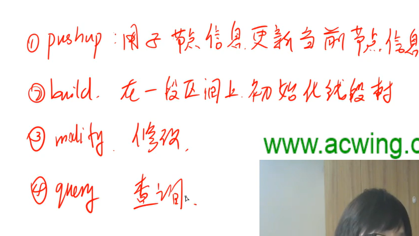
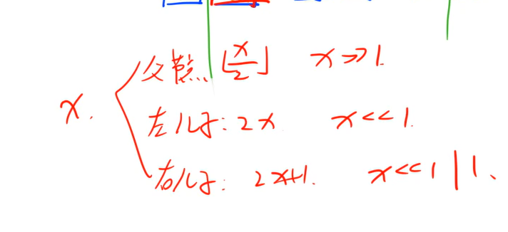

树状数组代码：

```java
import java.util.*;

public class Main{
    static final int N = 100010;
    static int n,m;
    static int[] a = new int[N];
    static int[] tr = new int[N];
    
    public static int lowbit(int x){
        return x&-x; //求二进制1所在的位置
    }
    
    public static void add(int x,int v){
        for(int i=x;i<=n;i+=lowbit(i)) tr[i] += v;
    }
    
    public static int query(int x){
        int res = 0;
        for(int i=x;i!=0;i-=lowbit(i)) res+=tr[i];
        return res;
    }
    
    public static void main(String[] args){
        Scanner scanner = new Scanner(System.in);
        n = scanner.nextInt();
        m = scanner.nextInt();
        
        for(int i=1;i<=n;i++) a[i] = scanner.nextInt();
        for(int i=1;i<=n;i++) add(i,a[i]);
        
        while(m-->0){
            int k,x,y;
            k = scanner.nextInt();
            x = scanner.nextInt();
            y = scanner.nextInt();
            
            if(k==0) System.out.println(query(y)-query(x-1));
            else add(x,y);
        }
    }
}
```


树状数组

lowbit() x&-x

add(int x,int v) for(int i=x;i<=n;i+=lowbit(i)) x 

query() for(int i=x;i!==0;i-=lowbit(i)) res+=tr[i]

初始化，add(i,a[i])


线段树：




单点修改：




函数：



存储：




线段树代码：

```java
import java.util.*;

class Node{
    public int l,r,sum;
    public Node(int l,int r,int sum){
        this.l = l;
        this.r = r;
        this.sum = sum;
    }
}

public class Main{
    static final int N = 100010;
    static int n,m;
    static int[] w = new int[N];
    static Node[] tr = new Node[4*N];
    
    
    //子节点信息更新当前节点信息
    public static void pushup(int u){
        tr[u].sum = tr[u*2].sum + tr[u*2+1].sum;
    }
    
    //在一段区间上初始化线段树。u表示根节点，
    public static void build(int u,int l,int r){
        if(l==r) tr[u] = new Node(l,r,w[r]);
        else{
            tr[u] = new Node(l,r,0);
            int mid = l+r >> 1;
            build(u*2,l,mid);
            build(u*2+1,mid+1,r);
            pushup(u);
        }
    }
    
    public static int query(int u ,int l ,int r){
        if(tr[u].l>=l && tr[u].r<=r) return tr[u].sum;
        int mid =( tr[u].l + tr[u].r )/2;
        int sum = 0;
        if(l<=mid) sum += query(u*2,l,r);
        if(r>mid) sum += query(u*2+1,l,r);
        return sum;
    }
    
    public static void modify(int u,int x,int v){
        if(tr[u].l==tr[u].r) tr[u].sum+=v;
        else{
            int mid = (tr[u].l+tr[u].r)/2;
            if(x<=mid) modify(u*2,x,v);
            else modify(u*2+1,x,v);
            pushup(u);
        }
    }
    
    
 
    
    public static void main(String[] args){
        Scanner scanner = new Scanner(System.in);
        n = scanner.nextInt();
        m = scanner.nextInt();
        
        for(int i=1;i<=n;i++) w[i] = scanner.nextInt();
        build(1,1,n);
        
        while(m-->0){
            int k,x,y;
            k = scanner.nextInt();
            x = scanner.nextInt();
            y = scanner.nextInt();
            
            if(k==0) System.out.println(query(1,x,y));
            else modify(1,x,y);
        }
    }
}
```


