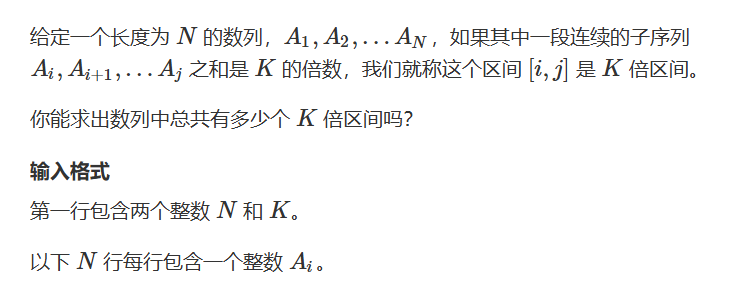

long  l = 0L ;

long的最大值：Long.MAX_VALUE

int 最小值：Integer.MIN_VALUE，最大值：Integer.MAX_VALUE


## 自定义类＆比较排序

```java

static class Node{

}

//新节点
Node n = new Node(x,y);

//创建队列
Queue<Node> q = new LinkedList<>()
    

class PIIs implements Comparable<PIIs> {
    public int t;
    public int id;

    public PIIs(int t, int id) {
        this.t = t;
        this.id = id;
    }

    @Override
    public int compareTo(PIIs o) {
        if (this.t != o.t) {
            return Integer.compare(this.t, o.t);
        } else {
            return Integer.compare(this.id, o.id);
        }
    }
}
```


## 字符串

``` java
//字符串

String s = 
s.charAt(i) // 字符串s的第i个字符
(char)(i+'A') //数字转字符串

String[] parts = line.split("\\s+");//这行代码的作用是将字符串 line 按照 空白字符 分割成多个部分
String[] start = parts[0].split(":"); //将 parts[0] 按照冒号 : 分割


String.format("%02d:%02d:%02d", hours, minutes, seconds); //前导0

```


## 数组

```java
//数组
System.arraycopy(a,0,b,0,n); //复制a到b，从a的下标0到b的下标0 一共n个数

Arrays.sort(logs,(a,b)->a[0]-b[0]);  //排序

```


## 滑动窗口

```java
//滑动窗口大小为k，需要一个头指针和尾指针，这两个指针只是代表q数组的下标，而q数组里存放的是a数组的下标，因此比较的对象是a[q[tt]]和a[i]
// 初始化 0 ，-1
// 一个for 一个if  一个while  得到++tt  输出最小值（从i-k+1开始）
int hh=0,tt=-1;
// q[] 存放a对应的下标值
for(int i=0;i<n;i++){
    if(hh<=tt && i-k+1>q[hh]) hh++;
    while(hh<=tt && a[q[tt]]>=a[i]) tt--; //队头是最小值
    q[++tt] = i;
    if(i-k+1>=0) System.out.println(a[q[hh]])
}
```


## 树

```java
//树

Arrays.fill(h,-1);

static void add(int a,int b,int c){
    e[idx] = b;
    w[idx] = c;
    ne[idx] = h[a];
    h[a] = idx++;
}

//遍历子树
for(int i=h[i];i!=-1;i=ne[i]){
    int j = e[i];
    if(st[j]) continue;
    dist[j] = dist[t] + w[i];
    st[j] = true;
    q.offer(j);
}

```


## 递归dfs（枚举）

```java
public static void dfs(int u){
        if(u>n) {
            for(int i=1;i<=n;i++) {
                if(st[i]) System.out.print(i+" ");
            }
            
            System.out.println();
            return;
        }
        
        st[u]=true;
        dfs(u+1);
        st[u]=false; //回溯要标记,可选可不选
        dfs(u+1); 
    }

//主函数:
dfs(1); //从第一个数开始枚举


//全排列，记录每一次的路径
 public static void dfs(int u){
        if(u>n) {
            for(int i=1;i<=n;i++) System.out.print(path[i]+" ");
            System.out.println();
        }
        
        for(int i=1;i<=n;i++){
            if(!st[i]) {
                path[u]=i; //当前路径选i
                st[i]=true;
                dfs(u+1);
                st[i]=false;
            }
        }
        
    }

//主函数:
dfs(1); //从第一个数开始枚举

```


## K倍区间



```java
import java.util.*;

public class Main {
    static final int N = 100010;
    
    public static void main(String[] args) {
        Scanner scanner = new Scanner(System.in);
        int n = scanner.nextInt();
        int k = scanner.nextInt();
        
        // 使用 long 类型存储前缀和防止溢出
        long[] s = new long[N];
        for (int i = 1; i <= n; i++) {
            s[i] = s[i - 1] + scanner.nextLong(); // 输入数据也需要用 long 类型
        }

        long res = 0;
        int[] cnt = new int[k];
        cnt[0] = 1;
//cnt[i] i中存放的是前缀和除以k的余数，
//cnt的值就是这个余数的个数，如果有两个前缀和的余数相等的话，
 //也就是说存在一个区间里的数可以整除k
 
        for (int i = 1; i <= n; i++) {
            int mod = (int) ((s[i] % k + k) % k); // 确保余数计算正确
            res += cnt[mod];  //数组的下标只能是int型，所以不能直接计算s[i]%k
            cnt[mod]++;
        }

        System.out.println(res);
    }
}
```


## 日期

```java

static int[] months = {0,31,28,31,30,31,30,31,31,30,31,30,31};
    
    static int is_leap(int year){
        if((year%4==0 && year%100!=0) || year%400==0) return 1;
        
        return 0;
    }
    
    static int get_day(int y,int m){
        if(m==2) return 28+is_leap(y);
        return months[m];
    }
    
    
    static boolean check(int date){
        int year = date/10000;
        int month = date%10000/100;
        int day = date%100;
        
        if(month<1||month>12) return false;
        if(day<1 || day>get_day(year,month)) return false;
        
        return true;
    }
```


## 背包问题

### 01背包

```java
for(int i = 1;i<=n;i++)
    for(int j =0;j<=m;j++){
        if(j<v[i]) f[i][j] = f[i-1][j]; //不选当前
        else f[i][j] = max(f[i-1][j],f[i-1][j-v[i]]+w[i]); // 选
    }
```


### 完全背包（每个物品可以用多次）

```java
for(int i = 1;i<=n;i++)
    for(int j =0;j<=m;j++){
        if(j<v[i]) f[i][j] = f[i-1][j]; //不选当前
        else f[i][j] = max(f[i-1][j],f[i][j-v[i]]+w[i]); // 选
    }
```


## DP种类

```java
1. f[i][j]: 所有a[1-i],b[1-j]的公共子序列集合
    求集合的最大值
    划分是以选不选a[i]和b[j]划分出四个集合
2. f[i][j]：所有将i-j合并成一堆方案的集合
    求最小代价
    每次合并左右两边，所以划分的依据k为k在[i,j]区间里
    然后求每次合并的最小代价
    循环有三层
    for(int len=2;len<=n;len++) //len表示区间里的点的数量
		for(int i=1;i+len-1<=n;i++)
		{
			int l=i,r=i+len-1;
			f[l][r]=1e8; //初始化f[l][r]为无穷大
			for(int k=l;k<r;k++)
				f[l][r]=min(f[l][r],f[l][k]+f[k+1][r]+s[r]-s[l-1]);
		}

```


