## 网络信息内容概念

### 网络信息安全分类

网络内容安全目前大致可分为两类：

1. 基于内容的**访问控制**，包括网络协议恢复，基于数据包的流量监测，基于特征码的病毒防护等技术

2. 基于信息传播的互联网安全管理问题，反映的是网络用户**公开发布的信息**所带来的对**社会公共安全**问题

### 信息安全层次结构

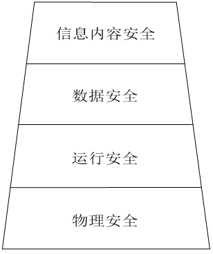

- **网络信息内容安全**处在安全体系中**最上层**，更倾向于信息自身的安全

- **网络信息内容安全是研究如何利用基层动态网络的海量信息中对与特定安全主题相关的信息进行自动获取，识别和分析的技术。**

## 网络信息内容和传统信息安全学科区别

- **信息安全**是研究确保信息的完整性，可用性，保密性，可控性以及可靠性的一门学科。
- 信息安全学科**研究的内容**包括信息**设备安全，数据安全，内容安全和行为安全**4个方面问题。
- 主要的**研究方向**有密码学，网络安全，信息系统安全和信息内安全。
- **网络信息内容安全**主要是研究禁止**非法的内容**进入，和**有价值的内容**泄露的一门学科。

关键技术：信息内容管理、信息内容过滤，信息内容监控，信息内容还原。

- Information content management
  Information content filtering 
  Information content monitoring 
  Information content restore

研究信息内容安全问题的过程。是在理解信息内容基础上的3分类过程：
一，句法分析：判断信息是否为**可读语句**，又称为语句分类。
二，主题分类：判断有可读语句表达的信息。是否属于**所关注的安全领域**，又称领域分类或主题分类。
三，倾向分析：判断落入某领域的信息是否符合所定义的**安全准则**。又称安全分类。

## 网络信息内容安全内涵

| **领域**     | **内涵**                                                     | **关键技术**           |
| ------------ | ------------------------------------------------------------ | ---------------------- |
| **政治方面** | 防止来自国内外反动势力的攻击、诬陷以及西方的和平演变阴谋，维护社会稳定 | 网络舆情分析、内容还原 |
| **安全方面** | 防止国家、军队和企业机密信息被窃取、泄露和流失               | 开源情报分析           |
| **宗教方面** | 防止法轮功等邪教组织利用宗教信仰传播不利于和谐社会的内容     | 话题检测与跟踪         |
| **破坏方面** | 防止病毒、垃圾邮件、网络蠕虫等恶意信息耗费或破坏网络资源     | 内容过滤、内容还原     |
| **健康方面** | 在传播过程中剔除侧请、淫秽和暴力内容，使人们健康上网         | 网络内容过滤           |
| **生产方面** | 防止非生产力网络浏览、提高企业网络使用效率                   | 内容管理               |
| **隐私方面** | 防止个人隐私被盗取、倒卖、滥用和扩散                         | 开源情报分析           |

## 网络信息内容安全研究的意义

- 提高网络用户及网站的使用效率
- 净化网络空间，营造健康文明的网络文化环境
- 提高国家信息安全保障水平是保障国家安全的重要环节

## 网络媒体信息划分方法

网络媒体信息是指互联网公开发布的信息

- 网络媒体形态（广播式交互式）
- 发布信息类型（文本、图像...）
- 媒体发布方式（匿名实名）
- 网页具体形态（静态动态）

## 网络媒体信息获取一般流程

理想的网络媒体信息获取流程:

- 初始URL集合
- 信息获取
- 信息解析
- 信息判重

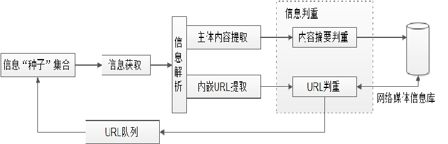

### 1. 初始URL集合

- 最初由搜索引擎研究人员提出
- 维护相当数量初始URL集合
- 网页内嵌地址的递归操作
- 形象地称为信息“种子”集合

跟随网页内嵌链接逐级递归遍历互联网络: 

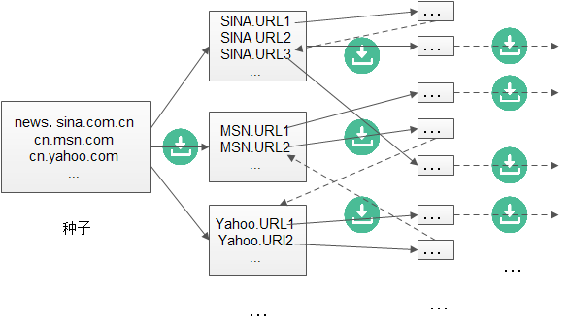

### 2.信息获取

- 待获取内容协议解析
- 向信息发布网站请求所需内容
- 接收来自网站的响应信息
- 传递给后续的信息解析模块

HTTP文本信息获取范例: 

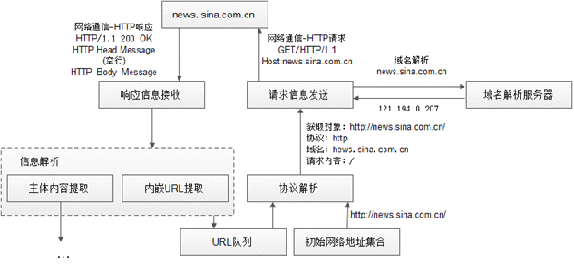

### 3. 信息内容解析

- 提取发布信息的**主体内容**
- 维护与网络内容的关键字段
- 内容转交至信息判重模块
- 关键字段存入信息库

维护与网络内容的关键字段：
**关键字段类似信息的标签**。比如电影影评里，电影名、主演、评分、类型等是关键字段。这些字段能帮我们分类、检索信息。像在图书馆找书，按类别、作者等标签找就容易。我们分析网络信息时，要确定这些关键字段，方便后续处理。

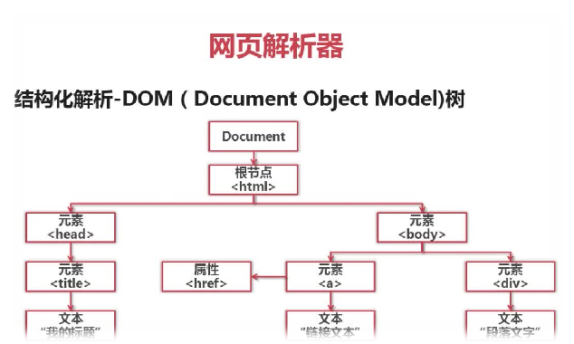

### 4. 信息判重

- 判定是否已获取内嵌URL信息内容
- 若是，注明信息失效时间及最近修改时间的URL
- 否则重启完整的信息采集操作
- 向对应的网络内容发布媒体发起信息查新获取操作

网络是个大图书馆，每个网页像一本书，URL 就是书的编号。信息判重时，首先看这个编号（URL）对应的书我们之前有没有拿过。而且不管这本书之前拿没拿过，咱都可以问问图书馆管理员（对应网络内容发布媒体），这本书有没有新的版本或者新内容。

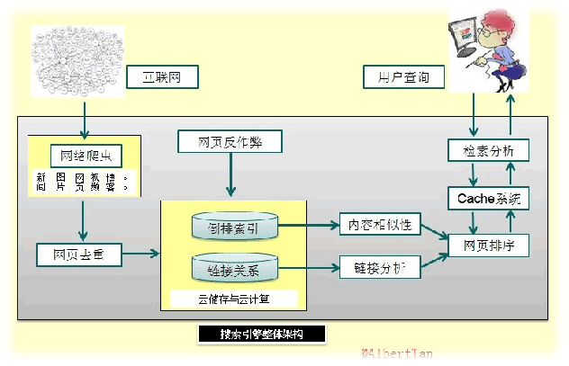

## 网络媒体信息获取的分类

1. 全网信息获取

- 全网信息获取工作范围涉及整个国际互联网内所有网络媒体发布信息，
  应用于搜索引擎(SearchEngine)，例如Google、Baidu或Yahoo等，和大型内容服务提供商(ContentServiceprovider)的信息获取。

2. 定点信息获取

- 定点信息获取的工作范围限制在服务于信息获取的初始URL集合中每个URL所属的网络目录内
  深入获取每个初始URL所属的网络目录及其下子目录中包含的网络发布内容，不再向初始URL所属网络目录的上级目录
  乃至整个互联网扩散信息获取行为

3. 基于主题的信息获取与元搜索

- 元搜索属于特殊的基于主题的信息获取
  将主题描述词传递给搜索引擎进行信息检索，并把搜索引擎针对主题描述词的信息检索结果作为基于主题信息获取的返回内容
  原因是，每个搜索引擎在为输入词目构造信息检索URL时是有规律可循的。

## 搜索引擎信息检索URL构造范例

- **元搜索**技术正是通过在不同搜索引擎的网络交互过程中
  根据每个搜索引擎的具体要求构造主题描述词信息检索URL，向搜索引擎发起信息检索请求。
  元搜索技术利用搜索引擎进行基于主题的信息获取操作，它把搜索引擎关于主题描述词的信息检索结果作为信息获取对象，从而实现面向特定主题的网络发布内容获取。

搜索引擎信息检索URL构造范例： 

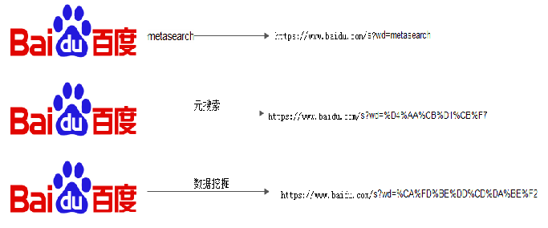

> 元搜索技术能实现的原因是，每个搜索引擎在为输入词目构造信息检索URL时是有规律可循的。

## 网页媒体信息获取方法

- 带身份认证静态媒体发布信息获取
- 内嵌脚本语言片段的动态网页信息获取

按网页具体形态分类，网络媒体信息又可分成静态网页与动态网页两类，不同方法获取方式不一样

## 带身份认证静态媒体发布信息获取

### 1. 基于Cookie机制实现身份认证

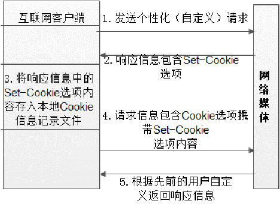

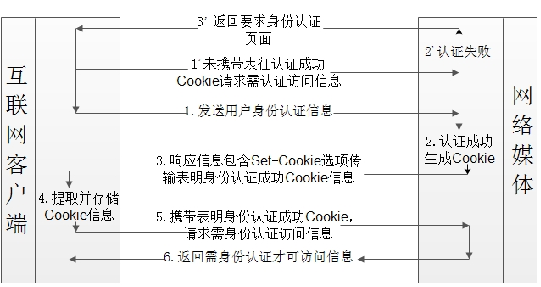

**Cookie 就像是我们进入特定区域的证件/说明**。在 HTTP 信息交互过程中，客户端先发出请求，服务器给我们一个带 Set - Cookie 选项的回复，我们把这个存起来，之后再请求时带上它，服务器就按我们之前的设定回复。而在身份认证请求里，如果我们没带认证成功的 Cookie 去要信息，服务器会先检查身份，通过了就给我们 Cookie，我们存好它，下次带着它就能拿到需要认证才能访问的信息。

### 2.基于网络交互重构实现信息获取

- 通过网络编程顺序模拟网络媒体信息请求过程
- 网络身份认证过程，都需要进行正确的网络交互过程模拟
- 媒体信息获取环节是通过响应信息返回码判断信息获取请求是否成功的

通过网络交重构获取到静态网络媒体起始网页发布信息后可以采用传统的基于HTML标记匹配的网页解析方法来提取网页主体内容及其内嵌url信息。例如可以从<w>和</body>标记中提取静态网页主体内容<ahref=/a>标记中提取网页内嵌URL信息。

## 动态网页信息获取

- 动态网页主体内容及其内嵌URL信息完全封装于网页源文件中的脚本语言片段内，无法直接使用基于HTML标记匹配方法提取网页主体内容及其内嵌URL信息。
- 可将脚本语言片段传递给Mozilla浏览器的脚本解释组件实现动态脚本解析并获得脚本片段所对应的静态网页内容

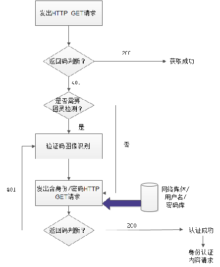

### 1.利用HTML DOM树提取动态网页内的脚本语言片段

HTML网页对应的HTML DOM树存储于浏览器内存对象中，该对象实现了包含若干方法的标准程序接口。网页开发人员可以通过相应接口，对HTML DOM树上的每个结点进行遍历、查询、修改或删除等操作，从而动态访问和实时更新HTML网页的内容、结构与样式

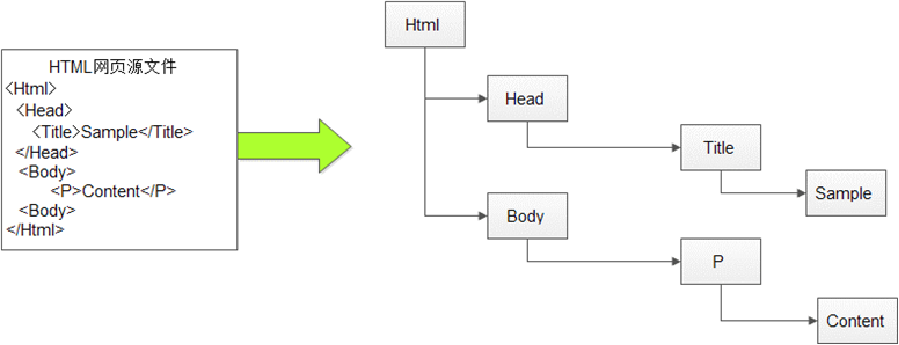

## 网络通信信息获取的一般方法

有线网络

- 端口镜像复制模式
- 攻击交换机以得到所有的数据包
- 攻击模式包括：MAC Flooding攻击和ARP包欺骗

## 端口镜像功能与应用

端口镜像功能介绍:

- 端口镜像可将特定端口数据完整复制到监控端口，便于网络流量分析与故障排查。
  例如，在企业网络中，通过镜像核心交换机端口，实时监测关键业务数据传输情况。

端口镜像配置要点

- 配置时需明确源端口与目的端口，确保镜像数据准确无误传输至监控设备。
  不同品牌交换机配置命令有差异，如华为交换机使用mirror命令，思科使用monitor命令。

端口镜像的优势与局限:

- 优势在于不改变网络拓扑结构，对网络性能影响小，可实时获取数据。
  局限是镜像端口数量有限，且无法获取加密数据，对复杂网络环境适应性稍差。

## 中文分词技术特点

- 中文是以字为基本书写单位，单个字往往不足以表达一个意思，通常认为词是表达语义的最小元素。因此须对中文字符串进行合理的切分。

字符串匹配: 

- 优点是：分词过程是跟词典作比较，不需要大量的语料库、规则库，其算法简单、复杂性小、对算法作一定的预处理后分词速度较快；
- 缺点是：不能消除歧义、识别未登录词，对词典的依赖性比较大，若词典足够大，其效果会更加明显。

## 分词中涉及到的基本问题

未登录词问题

- 未登录词又称为生词(unknown word)，可以有两种解释:一是指 已有的词表中没有收录的词;二是指已有的训练语料中未曾出现过的词，又称之为集外词(out of vocabulary，OOV)。

词库：粉色 红色 蓝色
生词：粉红

## 分词方法之-字符串匹配法

### 最大匹配算法(Maximum Matching)

最大匹配算法是基于词表进行分词操作的，主要包括正向正向最大匹配算法、逆向最大匹配算法、双向最大匹配算法等。 其主要原理都是切分出单字串(词语)，然后和词库进行比对，如果对比成功就记录下来，从整句切除下来， 否则减少一个单字，继续比较，直到字符串全部切除完毕，即分词成功，数组中的所有词语即是分词结果。

如目标语句：   sentence = ‘研究生物学’
词典：                ch_dict = [‘研究’,‘生’,‘生物’,‘生物学’]

###  正向最大匹配算法(Forwards Maximum Match，FMM)

如目标语句：   sentence = ‘研究生物学’
词典：                ch_dict = [‘研究’,‘生’,‘生物’,‘生物学’]
最大匹配值：   max_match_len = 5

从字符串的正方向出发，先截取前5个字符，与词典库中的词语进行对比。若比对不成功，则截取前4个字符进行对比，依次类推，直到仅剩第一个字符，自动进行截取，此次截取结束；若对比成功，则将该词语记录下来，并从句子中截取下来。直至句子全部被拆分为词语，以数组进行存储。

### 逆向最大匹配算法(Reverse Maximum Match，RMM)

如目标语句：   sentence = ‘研究生物学’
词典：                ch_dict = [‘研究’,‘生’,‘研究生’,‘生物’,‘生物学’]
最大匹配值：   max_match_len = 5

和FMM相反,从后向前匹配：

再试试
目标语句：   sentence = '我们球队打败了他们成为冠军'
词典：ch_dict = [‘我们’,‘球队’,‘球队打败了’,’他们’,’打败了他们’,‘成为冠军’]

最大匹配值：   max_match_len = 6

FMM: 我们/球队打败了/他们/成为冠军
RMM：我们/球队/打败了他们/成为冠军

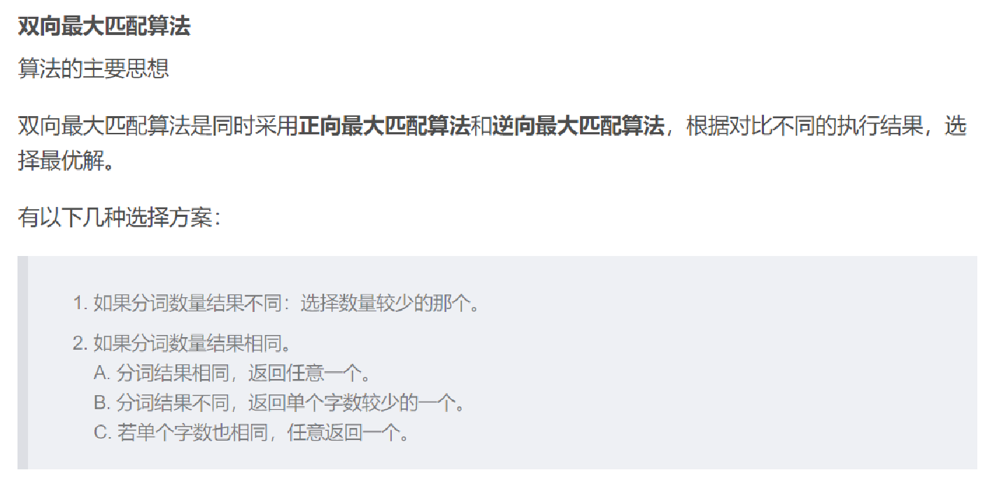

## 去停用词

计算机对其处理不但是没有价值的工作，还会增加运算复杂度，通常文本的停用词处理中可采用基于词频的方法将其除去

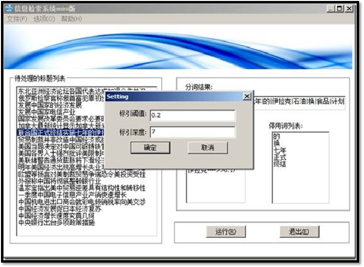

## 语义特征提取

语义特征需具备如下特征：

- 特征项要能确实标识文本内容
- 具有将目标文本与其他文本相区分的能力
- 特征项的个数不能太多
- 特征项的个数不能太多

根据语义级别由低到高来分，文本语义特征可分为：亚词级别、词级别、多词级别、语义级别和语用级别。其中，应用最为广泛的是词级别。

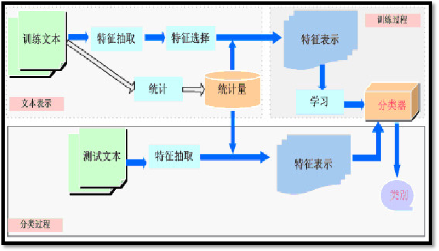

## 语义特征提取——词袋模型

如下的向量来表示某第二篇，以便于计算机理解和处理。
　　w2=（文本，5，统计学习，4，模型，0，……）

　　这个向量表示在w2所代表的文本中，“文本”这个词出现了5次（这个信息就叫做词频），“统计学习”这个词出现了4次，而“模型”这个词出现了0次，依此类推，后面的词没有列出。

系列的第三篇文章可以表示为
　　w3=（文本，9，统计学习，4，模型，10，……）
　　其含义同上。如果还有更多的文档需要表示，我们都可以使用这种方式。

例如我们的问题就可以抽离出一个词典向量
　　D=（文本，统计学习，模型，……）
　　所有的文档向量均可在参考这个词典向量的基础上简化成诸如
　　w2=（5，4，0，……）
　　w3=（9，4，10，……）
　　的形式，其含义没有改变。
　　5，4，10这些数字分别叫做各个词在某个文档中的权重，实际上单单使用词频作为权重并不多见，也不十分有用，更常见的做法是使用地球人都知道的TF/IDF值作为权重。

### 余弦相似度

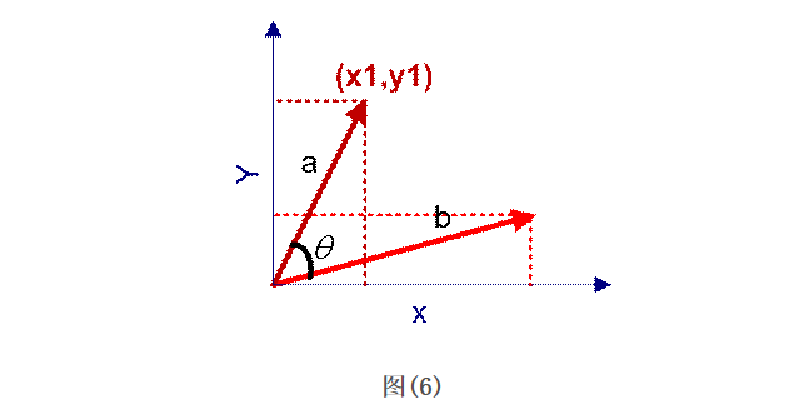

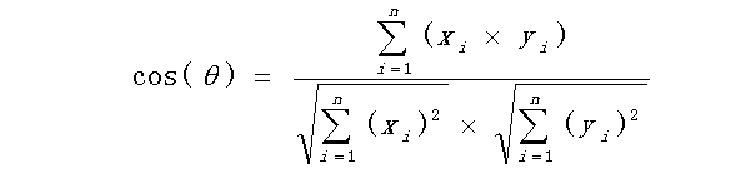

举一个例子来说明，用上述理论计算文本的相似性。为了简单起见，先从句子着手。
句子A：这只皮靴号码大了。那只号码合适
句子B：这只皮靴号码不小，那只更合适

怎样计算上面两句话的相似程度？
基本思路是：如果这两句话的用词越相似，它们的内容就应该越相似。因此，可以从词频入手，计算它们的相似程度。

第一步，分词。
句子A：这只/皮靴/号码/大了。那只/号码/合适。
句子B：这只/皮靴/号码/不/小，那只/更/合适。

第二步，列出所有的词。
这只，皮靴，号码，大了。那只，合适，不，小，很

第三步，计算词频。
句子A：这只1，皮靴1，号码2，大了1。那只1，合适1，不0，小0，更0
句子B：这只1，皮靴1，号码1，大了0。那只1，合适1，不1，小1，更1

第四步，写出词频向量。
　　句子A：(1，1，2，1，1，1，0，0，0)
　　句子B：(1，1，1，0，1，1，1，1，1)
到这里，问题就变成了如何计算这两个向量的相似程度。

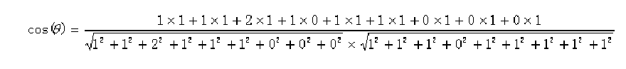

计算两个句子向量
句子A：(1，1，2，1，1，1，0，0，0)
和句子B：(1，1，1，0，1，1，1，1，1)的向量余弦值来确定两个句子的相似度。

## 多词级别语义特征

多词级别（Multi-Word Level）：

- 指用多个词作为文本的特征项
- 如 machine learning、text classification等
- 采用单个词进行表示会损失语义信息
- 考虑同现频率

## 文档频率阈值法与齐夫定律

文档频率阈值法:

- 用于去除训练样本集中出现频率较低的特征项
- 词频对标识文本类别的重要性
- 齐夫定律
- 单词出现的频率rank(t)与其序号n(t)存在近似反比关系

## TF-IDF(特征项频率——逆文本频率指数

TF-IDF（Term Frequency-Inverse Document Frequency）即词频 - 逆文本频率指数，是信息检索与文本挖掘中常用的加权技术，用于评估一个词对于一个文件集或语料库中的某一份文件的重要程度。

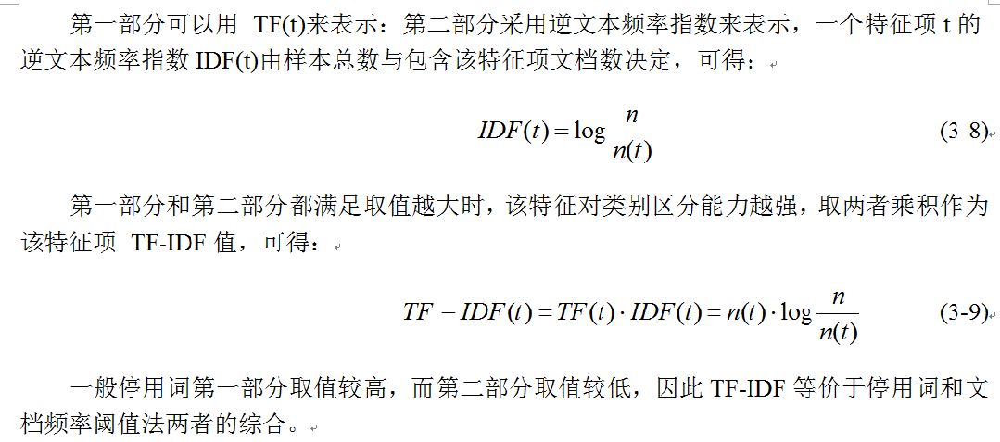

TF-IDF方法结合考虑两个部分，第一部分认为，出现次数较多的特征项对分类贡献较大；第二部分认为，如果一个特征项在训练样本集中的大多数样本中都出现，则该特征项对分类贡献不大，应当去除

## 语义特征提取

假定该文长度为1000个词，“中国”、“蜜蜂”、“养殖”各出现20次，则这三个词的“词频”（TF）都为0.02。假设中文网页有250亿

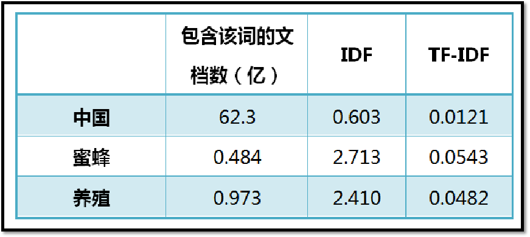

"蜜蜂"的TF-IDF值最高，"养殖"其次，"中国"最低。（如果还计算"的"字的TF-IDF，那将是一个极其接近0的值。）所以，如果只选择一个词，"蜜蜂"就是这篇文章的关键词。

## 文本语法分析（定义）

n-gram模型，称为N元模型，可用于定义字符串中的距离，也可用于中文的分词；该模型假设第n个词的出现只与前面n-1个词相关，与其他词都不相关，整个语句的概率就是各个词出现概率的乘积；而这些概率，利用语料，统计同时出现相关词的概率次数计算得到；常用的模型是Bi-gram和Tri-gram模型。

假设一个字符串s由m个词组成，因此我们需要计算出P(w1,w2,⋯,wm)的概率，根据概率论中的链式法则得到如下：P(w1,w2,…,wm) = P(w1)*P(w2|w1)*P(w3|w1,w2|)…P(wm|w1,w2…wm-1)

语料库：“苹果是水果”，“我喜欢苹果”，“水果很美味”
任务：用户输入 “苹果” ，估算输入 “苹果是” 和 “苹果很” 的概率。
Bi-gram
P(苹果)=1
P(苹果是）=P（苹果）*P（是|果）=1*count（果是）/count（果）
=1/4

P（苹果很）=P（苹果）*P（很|果）=1*count（果很）/count（果）
=1/4

## 网络信息内容过滤概述---定义

定义：根据用户的信息需求，运用一定的标准和工具，从大量的动态网络信息流中选取相关的信
息或剔除不相关信息的过程。

- 相比于信息检索技术，网络信息过滤技术是一种更系统化的方法，用来从动态的信息流中抽取出符合个性化需求的信息
- 相比于传统的信息检索模式，信息过滤技术具有较高的可扩展性，能适应大规模用户群和海量信息
- 可以为用户提供及时、个性化的信息服务，具有了一定的智能和较高的自动化程度

## 网络信息内容过滤模型

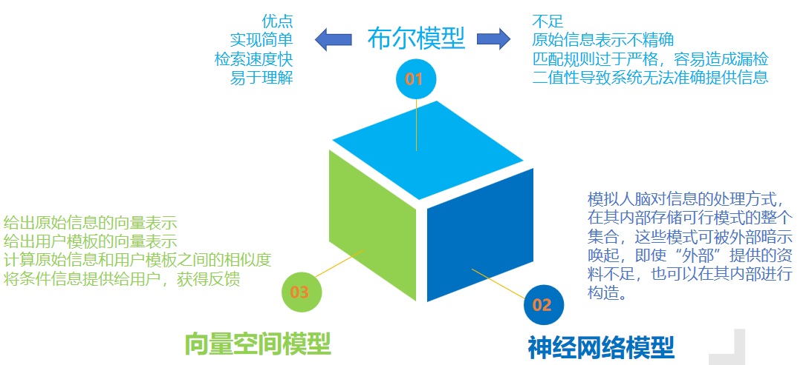

## 期末考试

注意：
其中重点考察内容：
理解Bi-gram
理解文本向量相似度的计算方法
理解TF-IDF
理解字符串匹配法的原理和步骤