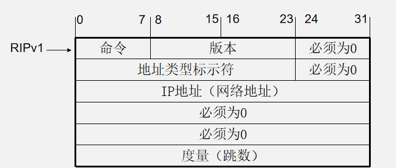

# 第四章、RIP

- RIP 路由信息协议（Routing Information Protocol，简称RIP）

- RIP只能用于在自治系统内实现路由的动态学习

- RIP协议是一种基于距离矢量路由算法的动态路由协议

R1和R2初始路由表里只有相邻的网络

R2收到R1的路由之后更新自己的路由

## RIP中定时器

1、更新定时器（Update Timer）：RIP默认发送路由更新的时间间隔为30秒。

2、无效定时器（Invalid Timer）：路由器在足够长的规定时间间隔内还没有收到路由表中某个RIP路由条目的更新信息，则将该路由条目定义为“无效（Invalid）”，RIP协议规定无效定时器的默认值为180秒

3、清除定时器（Flush Timer）： RIP协议规定清除计时器默认值为240 秒

4、抑制计时器（Hold Down Timer）：RIP协议中抑制计时器的默认值为180秒

`show ip protocols 可以查看抑制时间`

5、触发定时器（Triggered Update Timer）：RIP协议规定，触发更新定时器的时间为1~5秒内的一个随机值

## RIP特性

### 自动汇总特性

- RIP在主类网络的**边界路由器**上对来自同一主类网络的路由进行自动汇总

- RIPV1不能禁用自动汇总功能，RIPV2可禁用自动汇总功能

### RIP网络收敛慢特性

##  RIPv1&RIPv2

| **RIPv1**                                | **RIPv2**                            |
| ---------------------------------------- | ------------------------------------ |
| **无身份验证功能**                       | **有身份验证功能**                   |
| **报文中不携带子网掩码信息，不支持VLSM** | **报文中携带子网掩码信息，支持VLSM** |
| **报文中无下一跳**IP地址信息             | **报文中有下一跳IP地址信息**         |
| **采用广播方式传递信息**                 | **采用组播方式传递信息**             |
| **无路由标记**                           | **采用了路由标记**                   |
|                                          | **具有RIPv1的所有功能**              |

### RIPv1报文格式

- RIP 消息的数据部分封装在 UDP 数据段报中

- 采用的UDP源端口号和目的端口号均为“520”
- RIP v1采用广播发送路由更新消息

- 在IP分组头和数据链路层帧头中，目的地址均使用广播地址，其地址分别为“255.255.255.255”和“FF-FF-FF-FF-FF-FF”
- 

RIP v1消息的报文格式：

- 命令字段（Command）：指定消息的类型。当值为“1”时，表示请求部分或全部的路由信息，当值为“2”时，表示应答给发送方的全部或部分路由信息。
- 版本字段（Version）：表示RIP的版本， RIPv1的版本字段值为“1”。
- 地址类型标识字段（Address Family Identifier）：用于设置路由条目中的地址类型，其值为“2”时，表示IP地址，当值为“0”时，表示请求完整的路由表。
- IP地址（IP Address）：路由条目所对应的目标地址，通常为网络地址或子网地址，但也可以是主机地址。
- 度量（Metric）：其值为“1”到“16”，当地址类型字段值为“2”时，该字段值对应于到目的网络的跳数；当地址类型字段值为“0”时，该字段值被设置为“16”。

- 请求报文中的命令字段值和地址类型字段值分别为“1”和“0”，以请求这些接口所连的 RIPv1邻居路由器发送其完整的路由表。
- 邻居路由器在收到RIPv1请求报文后，将会根据请求发出应答消息，应答报文中的命令字段值为“2”，地址类型字段为“2”。

### RIPv2的报文格式：

>  相对于RIPv1，增加了“子网掩码”和“下一跳”字段

### RIPv1的工作过程

1）首先，路由器R1从F0/0、F0/1和F1/0接口发送RIPv1请求消息
2）路由器R2与路由器R3从自己的F0/1接口收到R1的RIPv1请求消息后，向路由器R1发出响应消息
3）路由器R1从接口F0/0、F0/1和F1/0发送触发更新消息

### RIPv1的规划要点

- 首先，需要考虑该路由器**有哪些直接相连的网络**需要参与到RIPv1的路由更新中。
- 其次，要考虑是否将某些接口设置为**被动接口**

### RIPv2的规划要点

规划时需要考虑以下四个因素：
1）需要考虑该路由器**有哪些直接相连的网络**需要参与到RIPv2的路由更新中；
2）要考虑是否将某些接口设置为**被动接口**，以减少不必要的网络开销；
3）是否存在不连续的子网，若存在的话，需要在边界路由器上**禁用自动汇总**功能，以防止子网路由更新信息的丢失；
4）根据网络安全的需要，决定是否需要**配置认证**以增加路由更新的安全性。

### RIPv1的配置要点

RIPv1的配置通常需要三个步骤：

- 首先，在路由器上**启用RIPv1路由协议**；
  其次，指定需要参与到RIPv1路由更新的**直连网络**；
  第三步，根据网络实际情况，决定是否需要配置被动接口优化路由，
  其中，第三步是一个可选步骤。
- 
  - network directly-connected-classful-network-address   //指定参与到RIPv1路由更新的直连网络
  - passive-interface interface-type interface-number  //指定哪些接口为被动接口

### RIPv2的配置要点

- 进行RIPv2的配置时一般需要五个步骤：
  1）在路由器上**启用RIPv2路由协议**；
  2）指定哪些**直接相连的网络**需要参与到RIPv2的路由更新中；
  3）根据网络实际情况，决定是否需要配置**被动接口**；
  4）如果有不连续的子网，需要在边界路由器上禁用自动汇总功能；
  5）进行路由认证的配置（注意，随着适合于大规模网络的路由协议出现，在实际工程中RIPv2 身份验证使用并不常见）。
  其中，前两个步骤是必需的，而后三个步骤根据不同的网络需求，是可选的。
- 

### RIPv1不足

1. classful有类协议，不通告掩码  
2. 路由更新是广播:255.255.255.255
3.  不支持认证
4. 不支持VLSM

### RIPv2的改进

RIPv2与RIPv1的基本数据包格式相同，但RIPv2添加了三项重要扩展。
1、子网掩码  支持VLSM

2、路由标记  支持外部路由重分配到RIPv2协议中

3、下一跳    标识一个比通告路由更好的下一跳地址

4、RIPv2采用组播（224.0.0.9）更新

## 一些命令

- `display ip routing-table` : 查看路由表
- 默认静态路由优先级为60
- `ip route-static 10.0.13.0 24 10.0.23.3`:  配置目的地址为10.0.13.0/24的静态路由，路由的下一跳配置为R3的G0/0/0接口IP地址10.0.23.3
- `tracert 10.0.13.3` : **tracert**命令，可以查看数据的传输路径。
- `undo shutdown`: 关闭接口
- `debugging rip 1` : 执行**debugging**命令，查看RIPv1协议的定期更新情况
- `display debugging` :查看当前的调测信息
- `undo debugging rip 1` : 关闭调测功能。

