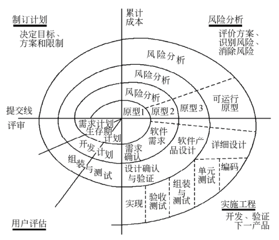
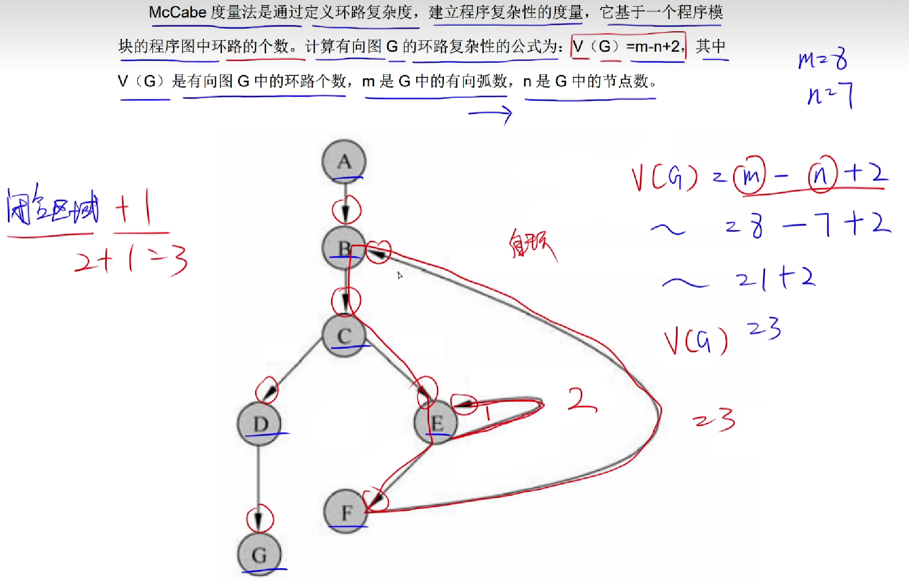

## 软件过程

### 1. 能力成熟度模型（CMM）

CMM 将软件过程改进分为以下5个成熟度级别：

1）初始级（最低成熟度）

软件过程的特点是杂乱无章，有时甚至很混乱，几乎没有明确定义的步骤，**项目的成功完全依赖个人的努力和英雄式核心人物的作用。**

2）可重复级

建立了基本的项目管理过程和实践来**跟踪项目费用、进度和功能特性**，有必要的过程准则来重复以前在同类项目中的成功。

3）已定义级

管理和工程两方面的**软件过程已经文档化、标准化**，并综合成整个软件开发组织的**标准软件过程**。

4）已管理级

制定了软件过程和产品质量的详细度量标准。**软件过程的产品质量都被开发组织的成员所理解和控制。**

5）优化级（最高成熟度）

加强了定量分析，通过来自**过程质量**反馈和来自**新观念、新技术**的反馈使过程能不断持续地改进。

### 2. 能力成熟度模型集成（CMMI）

CMMI 提供了两种表示方法：

1）阶段式模型

阶段式模型的结构类似于 CMM，它关注组织的成熟度。

有五个成熟度等级：

- 初始的：过程不可预测且缺乏控制。
- 已管理的：过程为项目服务。
- 已定义的：过程为组织服务。
- 定量管理的：过程已度量和控制。
- 优化的：集中于过程改进。

2）连续式模型

连续式模型关注每个过程域的能力，一个组织对不同的过程域可以达到不同的过程域能力。

CMMI 中包括6个过程域能力等级：

- CL₀（未完成的）：过程域**未执行**或**未得到** CL₁ 中定义的所有目标。
- CL₁（已执行的）：其共性目标是过程将可标识的输入工作产品转换成可标识的输出工作产品，以实现支持**过程域的特定目标**。
- CL₂（己管理的）：其共性目标**集中于己管理的过程的制度化**。根据组织级政策规定过程的运作将使用哪个过程，项目遵循己文档化的计划和过程描述，所有正在工作的人都有权使用足够的资源，所有工作任务和工作产品都被监控、控制和评审。
- CL₃（己定义级的)：其共性目标**集中于己定义的过程的制度化**。过程是按照组织的剪裁指南从组织的标准过程集中剪裁得到的，还必须收集过程资产和过程的度量，并用于将来对过程的改进。
- CL₄(定量管理的)：**其共性目标集中于可定量管理的过程的制度化**。使用测量和质量保证来控制和改进过程域，建立和使用关于质量和过程执行的定量目标作为管理准则。
- CL₅（优化的)：**使用量化（统计学）手段改变和优化过程域**，以满足客户要求的改变和持续改进计划中的过程域的功效。

##  软件过程模型

软件开发过程模型是指为了有效地开发、维护和更新软件系统，提出的一系列步骤、阶段和方法的系统框架，以实现提高软件质量、加快开发速度和降低开发成本的目的。

常见的软件开发过程模型包括瀑布模型、增量模型、演化模型（原型模型、螺旋模型）和喷泉模型。

### 瀑布模型

瀑布模型是一种线性的软件开发过程模型，开发流程严格按照顺序依次进行，每个阶段都必须完成后才能进入下一个阶段。瀑布模型包括需求分析、设计、编码、测试和维护五个阶段。

瀑布模型：

- 优点：

  - 容易理解、管理成本低
  - 每个阶段都有对应的成果产物
  - 各个阶段有明显的界限划分和顺序需求
  - 强调开发的阶段性早期计划及需求调查和产品测试

- 缺点：

  - 需要客户能够完整、正确和清晰地表达自己的需要

  - 在开始的两个或3个阶段中，很难评估真正的进度状态

  - 当接近项目结束时，出现了大量的集成和测试工作

  - 直到项目结束之前，都不能演示系统的能力

  - 一旦发生错误，整个项目要推到重新开始。

  - 需求或设计中的错误往往只有到了项目后期才能够被发现，对于项目风险的控制能力较弱，从而导致项目常常延期完成，开发费用超出预算

瀑布模式适合用于：

- 开发需求明确的，需求大致固定且不会随意变更的系统
- 开发人员对软件的应用领域很熟悉
- 开发工作对用户参与的要求很低

### 增量模型

增量模型采用了逐步完善的思路，将软件的开发过程划分为一个个的增量，每个增量都能够独立实现某一或多项功能或特性。在逐步实现的过程中，可以不断根据需求变化来进行迭代，从而保证最终的软件达到客户需求和期望。

增量模型作为瀑布模型的一个变体，具有瀑布模型的所有优点。此外，它还有以下优点：

- 第一个可交付版本所需要的成本和时间很少
- 开发由增量表示的小系统所承担的风险不大
- 由于很快发布了第一个版本，因此可以减少用户需求的变更
- 优先级高的功能先交付，使得重要的功能经历更多的测试
- 运行增量投资，即在项目开始时，可以仅对一个或两个增量投资

缺点：

- 如果没有对用户的变更要求进行规划，那么产生的初始增量可能会造成后来增量的不稳定
- 如果需求不像早期思考的那样稳定和完整，那么一些增量就可能需要重新开发、重新发布
- 管理发生的成本、进度和配置的复杂性可能会超出组织的能力

量模型适合用于：

- 需求尚不明确
- 需要快速构造可运行的产品的项目（对完成期限严格要求的产品）适宜商业开发
- 进行已有产品升级或新版本开发
- 对所开发的领域比较熟悉而且已有原型系统。

### 演化模型

演化模型是迭代的过程模型，使得软件开发人员能够逐步开发出更完整的软件版本。演化模型特别适用于对软件需求缺乏准确认识的情况。典型的演化模型有原型模型和螺旋模型等。

#### 原型模型

并非所有的需求都能够预先定义。大量的实践表明，在开发初期很难得到一个完整的、准确的需求规格说明。原因有：

- 客户往往不能准确地表达对未来系统的全面要求，导致形成的需求规格说明不完整、不准确，甚至是有歧义。
- 在整个开发过程中，用户可能会产生新的要求，导致需求的变更。

原型模型：

- 适合于用户需求不清、需求经常变化的情况
- 不适合大规模系统的开发

原型的目的是能快速、低成本地构建原型系统。

能够采用原型方法是因为开发工具的快速发展，使得能够迅速地开发出一个让用户看得见、摸得着的系统框架。这样，对于计算机不是很熟悉的用户就可以根据这个框架提出自己的需求。

开发原型系统首先确定用户需求，开发初始原型，然后征求用户对初始原型的改进意见，并根据意见修改原型:

1. 交流：目的是定义软件的总体目标，标识需求，然后
2. 快速计划：快速制订原型开发的计划，确定原型的目标和范围
3. 采用快速设计方式进行建模
4. 构建原型
5. 部署交付和反馈：被开发的原型应交付给客户使用，并收集客户的反馈意见，这些反馈意见可在下一轮中对原型进行改进
6. 下一轮迭代：在前一个原型需要改进，或者需要扩展其范围的时候，进入下一轮原型的迭代开发

根据使用原型的目的不同，原型可以分为：

- 探索型原型：目的是要弄清目标的要求，确定所希望的特性，并探讨多种方案的可行性。
- 实验型原型：目的是验证方案或算法的合理性，是在大规模开发和实现前，用于考查方案是否合适、规格说明是否可靠等。
- 演化型原型：目的是将原型作为目标系统的一部分，通过对原型的多次改进，逐步将原型演化成最终的目标系统。

#### 螺旋模型

对于复杂的大型软件，开发一个原型往往达不到要求。

螺旋模型将瀑布模型和演化模型结合起来，加入了两种模型均忽略的风险分析（以风险为驱动），弥补了这两种模型的不足。

螺旋模型将开发过程分为几个螺旋周期，每个螺旋周期大致和瀑布模型相符合：

螺旋模型属于面向对象开发模型。

螺旋模型适用于：

- 庞大、复杂并且具有高风险的系统；
- 新近开发，需求不明的情况。

优点：

- 支持用户需求的动态变化
- 螺旋模型强调风险分析，使得开发人员和用户对每个演化层出现的风险有所了解，从而做出应有的反应。
- 螺旋模型支持用户需求的动态变化，有助于提高软件的适应能力，降低了软件开发的风险。

缺点：

- 需要开发人员具有相当丰富的风险评估经验和专门知识。
- 过多的迭代次数会增加开发成本，延迟提交时间。

### 喷泉模型

喷泉模型：喷泉模型克服了瀑布模型不支持软件重用和多项开发活动集成的局限性

- 以用户需求为动力
- 以对象作为驱动
- 适合于面向对象

泉模型使开发过程具有以下性质或特点：

- **迭代性**：意味着模型中的开发活动常常需要重复多次，在迭代过程中不断地完善软件系统。

- **无间隙性**：指在开发活动（如分析、设计、编码）之间不存在明显的边界。

  喷泉不像瀑布模型那样，在需求分析活动结束后才开始设计活动，在设计活动结束后才开始编码活动，而是允许各开发活动交叉、迭代地进行。

  喷泉模型的各个阶段没有明显的界线，开发人员可以同步进行。

- 支持软件重用。

优点：可以提高软件项目的开发效率，节省开发时间。

缺点：

- 由于喷泉模型在各个开发阶段是重叠的，在开发过程中需要大量的开发人员，不利于项目的管理。

- 喷泉模型要求严格管理文档，使得审核的难度加大。

  

###  统一过程（UP）模型

|   阶段   |    里程碑    |        关注        |                   产生                   |
| :------: | :----------: | :----------------: | :--------------------------------------: |
| 初始阶段 | 生命周期目标 |   项目的初创活动   |  构想文档、业务用例、项目计划、风险评估  |
| 精化阶段 | 生命周期架构 | 需求分析和架构演进 | 补充需求分析、软件架构描述、架构原型制品 |
| 构建阶段 | 初始运作功能 |     系统的构建     |        具有最初运作能力的软件产品        |
| 移交阶段 |   产品发布   | 软件提交方面的工作 |               产品发布版本               |

## 敏捷方法

敏捷方法是一种反应灵活、拥有高度互动性和以人为本的软件开发方法。它的核心是通过不断地交付成果和及时反馈，来满足客户需求和不断变化的业务环境。以下是敏捷方法中的一些常见实践：

- 极限编程（XP）
- 水晶法（Crystal）
- 并列争求法（Scrum）
- 自适应软件开发（ASD）
- 敏捷统一过程（AUP）

### 极限编程（XP

极限编程是为了降低需求变更所带来的成本，旨在提高软件质量和对客户需求变化的适应性，期望能够让软件开发达到低成本、低缺陷、高产出、高回报（最小投入得到最大结果）的效果。

极限编程（XP）软件开发方式有以下性质：

- 轻量级（敏捷）
- 高效
- 低风险
- 柔性
- 可预测的
- 科学的

XP由价值观、原则、实践和行为4个部分组成，他们之间彼此相互依赖、关联，并通过行为贯穿于整个生存周期：

- 4大价值观：
  - 沟通
  - 简单性
  - 反馈
  - 勇气
- 5个原则：
  - 快速反馈
  - 简单性假设
  - 逐步修改
  - 提倡更改
  - 优质工作
- 12个最佳实践：
  - 计划游戏：快速制定计划、随着细节的不断变化而完善
  - 小型发布：系统的设计要能够尽可能早地交付
  - 隐喻：找到合适的比喻传达信息
  - 简单设计：只处理当前的需求，使设计保持简单
  - 测试先行：先写测试代码，然后再编写程序
  - 重构：重新审视需求和设计，重新明确地描述它们以符合新的和现有的需求
  - 结对编程：非正式的代码审查，以获得质量更高的代码
  - 集体代码所有制：任何开发人员都可以对系统的任何部分进行改进
  - 持续集成：可以按日甚至按小时为客户提供可运行的版本
  - 每周工作40个小时
  - 现场客户：系统最终用户代表应该全程配合XP团队
  - 编码标准

### 水晶法（Crystal）

- 认为每一个不同的项目都需要一套不同的策略、约定和方法论。
- 认为人对软件质量有重要的影响。随着项目质量和开发人员素质的提高，项目和过程的质量也随之提高。
- 通过更好地交流和经常性的交付，软件生产力得到提高。

### 并列争求法（Scrum）

使用迭代的方法。

- **把每30天一次的迭代称为一个“冲刺”。**
- 按需求的优先级别来实现产品。
- 多个自组织和自治的小组并行地递增实现产品。
- 协调是通过简短的日常情况会议来进行，就像橄榄球中的“并列争球”。

### 自适应软件开发（ASD）

有6个基本原则：

- 有一个使命作为指导；
- 特征被视为客户价值的关键点；
- 过程中的等待是很重要的，因此“重做”与“做”同样关键；
- 变化不被视为改正，而是被视为对软件开发实际情况的调整；
- 确定的交付时间迫使开发人员认真考虑每一个生产的版本的关键需求；
- 风险也包含其中。

### 敏捷统一过程（AUP）

敏捷统一过程采用以下原理来构建软件系统：

- “在大型上连续”
- “在小型上迭代”。

采用经典的UP阶段性活动（初始、精化、构建和转换），提供了一系列活动，能够使团队为软件项目构想出一个全面的过程流。

在每个活动里，一个团队迭代使用敏捷，并将有意义的软件增量尽可能快地交付给最终用户。每个AUP迭代执行以下活动：

- **建模**：建立对商业和问题域的模型表述，这些模型“足够好”即可，以便团队继续前进。
- **实现**：将模型翻译成源代码。
- **测试**：像XP一样，团队设计和执行一系列的测试来发现错误以保证源代码满足需求。
- **部署**：对软件增量的交付以及获取最终用户的反馈。
- **配置及项目管理**：着眼于变更管理、风险管理以及对团队的任一制品的控制。项目管理追踪和控制开发团队的工作进展并协调团队活动。
- **环境管理**：协调标准、工具以及适用于开发团队的支持技术等过程基础设施。

##  软件需求

软件需求是指用户对目标软件系统在功能、行为、性能、设计约束等方面的期望。通常，这些需求包括：

- **功能需求**：考虑系统要做什么，在何时做，在何时以及如何修改或升级。

- **性能需求**：考虑软件开发的技术性指标。

  - 存储容量限制；
  - 执行速度；
  - 响应时间；
  - 吞吐量。

- **用户或人的因素**：考虑用户的类型。

  - 各种用户对使用计算机的熟练程度，需要接受的训练；
  - 用户理解、使用系统的难度；
  - 用户错误操作系统的可能性。

- **环境需求**：考虑未来软件应用的环境，包括硬件和软件。

  - 对硬件设备的需求包括：机型、外设、接口、地点、分布、湿度、磁场干扰等；
  - 对软件的需求包括：操作系统、网络、数据库等。

- **界面需求**：

  - 来自其他系统的输入；
  - 到其他系统的输出；
  - 对数据格式的特殊规定；
  - 对数据存储介质的规定。

- **文档需求**：考虑需要哪些文档，文档针对哪些读者。

- **数据需求**：

  - 输入、输出数据的格式；
  - 接收、发送数据的频率；
  - 数据的准确性和精度；
  - 数据流量；
  - 数据需保持的时间。

- **资源使用需求**：

  - 软件运行时所需要的数据、其他软件、内存空间等资源；
  - 软件开发、维护时，所需的人力、支撑软件、开发设备。

- **安全保密要求**：

  - 是否需要对访问系统或系统信息加以控制；
  - 隔离用户数据的方法；
  - 用户程序如何与其他程序和操作系统隔离
  - 系统备份要求。

- **可靠性要求**：

  - 系统的可靠性要求；
  - 系统是否必须检测和隔离错误；
  - 出错后，重启系统允许的时间。

- **软件成本消耗与开发进度需求**：

  - 开发是否有规定的时间表；
  - 软/硬件投资有无限制。

- **其他非功能性要求**：

  如采用某种开发模式，需要确定：

  - 质量控制标准；
  - 里程碑和评审；
  - 验收标准；
  - 各种质量要求的优先级；
  - 可维护性方面的要求。

软件需求的出处：

- 可以来自于用户（实际的和潜在的）、用户的规约、应用领域的专家、相关的技术标准和法规；
- 可以来自于原有的系统、原有系统的用户、新系统的潜在用户；
- 可以来自于竞争对手的产品

## 系统设计

### 概要设计

1. 设计软件系统总体结构

   - 确定每个模块的功能
   - 确定模块之间的调用关系
   - 确定模块之间的接口
2. 数据结构及数据库设计
3. 编写概要设计文档
4. 评审

### 详细设计

1. 对每个模块进行详细的算法设计
2. 对模块内的数据结构进行设计
3. 对数据库进行物理设计
4. 其他设计
   1. 代码设计
   2. 输入输出格式设计
   3. 用户界面设计
5. 编写详细设计说明书
6. 评审

### 编码

根据详细设计进行代码的编写，得到可以运行的软件，并进行单元测试。

## 系统测试 

**意义**：系统测试是为了发现错误而执行程序的过程，成功的测试是发现了至今尚未发现的错误的测试。
**目的**：测试的目的就是希望能以最少的人力和时间发现潜在的各种错误和缺陷。

### 系统测试原则

1. 应尽早并不断地进行测试。
2. 测试工作应该避免由原开发软件的人或小组承担。
3. 在设计测试方案时，不仅要确定输入数据，而且要根据系统功能确定预期输出结果。
4. 在设计测试用例时，不仅要设计有效、合理的输入条件，也要包含不合理、失效的输入条件。
5. 在测试程序时，不仅要检验程序是否做了该做的事，还要校验程序是否做了不该做的事。
6. 严格按照测试计划来进行，避免测试的随意性。
7. 妥善保存测试计划、测试用例。
8. 测试用例都是精心设计出来的。
9. 系统测试阶段的测试目标来自于需求分析阶段。

## 单元测试（模块测试）

1. 单元测试的测试内容

   - 模块接口
     - 测试模块的输入参数和形式参数在个数、属性、单位上是否一致。
     - 调用其他模块时，所给出的实际参数和被调用模块的形式参数在个数、属性、单位上是否一致。
     - 调用标准函数时，所用的参数在属性、数目和顺序上是否正确。
     - 全局变量在各模块中的定义和用法是否一致。
     - 输入是否仅改变了形式参数。
     - 开/关的语句是否正确。
     - 规定的I/O格式是否与输入/输出语句一致。
     - 在使用文件之前是否已经打开文件或使用文件之后是否己经关闭文件。
   - 局部数据结构
   - 重要的执行路径
   - 出错处理
   - 边界条件
2. 单元测试过程

   - 驱动模块：接收测试例子的数据，将这些数据送到测试模块，输出结果。即模拟被测试模块的上一级模块，相当于被测模块的主程序。
   - 桩模块：代替测试模块中所调用的子模块，其内部可进行少量的数据处理。目的是为了检验入口、输出调用和返回的信息。
   - 提高模块的内聚度可以简化单元测试。

## 集成测试 

集成测试是进行一些旨在发现与接口相关的错误的测试，其目标是利用已通过单元测试的构件建立设计中描述的程序结构。

1. 自顶向下集成测试

​		自顶向下集成测试是一种构造软件体系结构的增量方法。

> 自顶向下集成不需要驱动模块，需要桩模块。

2. 自底向上集成测试

​		自底向上集成测试就是从原子模块（程序结构的最底层构件）开始进行构造和测试。

> 自底向上集成需要驱动模块，不需要桩模块。

3. 回归测试：重新执行己测试过的某些子集，以确保变更没有传播不期望的副作用。
4. 冒烟测试：一种常用的集成测试方法，是时间关键项目的决定性机制，它让软件团队频繁地对项目进行评估。

## 测试方法

测试方法分为：

- 静态测试：指被测试程序不在机器上运行，而是采用以下手段对程序进行检测

  - 人工检测：不依靠计算机而是依靠人工审查程序或评审软件。人工检测包括：
    - 代码检查
    - 静态结构分析
    - 代码质量度量
  - 计算机辅助静态分析

- **动态测试**：指通过运行程序发现错误。在对软件产品进行动态测试时可以采用以下两种测试方法：

  - **黑盒测试法**
  - **白盒测试法**

  测试用例由以下组成：

  - 测试输入数据
  - 预期输出结果：与测试输入数据对应的预期输出结果

  在设计测试用例时，应当包括：

  - 合理的输入条件
  - 不合理的输入条件

### 黑盒测试（功能测试）

黑盒测试在完全不考虑软件的内部结构和特性的情况下，测试软件的外部特性

- **等价类划分**：将程序的输入域划分为若干等价类，然后从每个等价类中选取一个代表性数据作为测试用例。当测试用例全是无效等价类时则不是一个好的测试用例。分类为：
  - 有效等价类
  - 无效等价类
- 边界值分析：输入的边界比中间更加容易发生错误，因此用边界值分析来补充等价类划分的测试用例设计技术。
- 错误推测
- 因果图

### McCabe度量法（边 - 节 + 2）

### 白盒测试（结构测试）

白盒测试根据程序的内部结构和逻辑来设计测试用例，对程序的路径和过程进行测试，检查是否满足设计的需要。

- **逻辑覆盖**：考察用测试数据运行被测程序时，对程序逻辑的覆盖程度。主要的逻辑覆盖标准有6种，它们的覆盖程度从低到高为：

  1. **语句覆盖**：指选择足够的测试数据，使被测试程序中的**每条语句至少执行一次**。语句覆盖对程序执行逻辑的覆盖很低，因此一般认为它是很弱的逻辑覆盖。

  2. **判定覆盖（分支覆盖）**：指设计足够的测试用例，使得被测程序中的**每个判定表达式至少获得一次“真”/“假”值**。判定覆盖的判定表达式是指判定表达式整体。判定覆盖要比语句覆盖更强一些。

  3. **条件覆盖**：指构造一组测试用例，使得每一判定语句中每**个逻辑条件的各种可能的值至少满足一次**。

     条件覆盖的判定语句是指判定表达式下的判定语句（如果有），即用`AND`、`OR`等逻辑运算符连接起来的语句（不包含逻辑运算符的语句）。

  4. **判定/条件覆盖**：指设计足够的测试用例，使得判定中每个条件的所有可能取值（真/假）至少出现一次，并使每个判定本身的判定结果（真/假）也至少出现一次。结果取判定覆盖和条件覆盖的并集。

     判定/条件覆盖同时满足：

     - 判定覆盖
     - 条件覆盖

  5. **条件组合覆盖**：指设计足够的测试用例，使得每个**判定中条件的各种可能值的组合都至少出现一次**。

     满足条件组合覆盖的测试用例一定满足：

     - 判定覆盖
     - 条件覆盖
     - 判定/条件覆盖

  6. **路径覆盖**：指覆盖被测试程序中**所有可能的路径**。

- 循环覆盖

- 基本路径测试

白盒测试逻辑覆盖技术总结（**覆盖程度从低到高**）：

|     逻辑覆盖     |                      说明                      |
| :--------------: | :--------------------------------------------: |
|     语句覆盖     |                每条语句执行一次                |
| 分支（判定）覆盖 |           每个分支获得一次True/False           |
|     条件覆盖     | 每个分支中的每个逻辑条件的所有可能取值满足一次 |
|  判定/条件覆盖   |              分支覆盖 + 条件覆盖               |
|   条件组合覆盖   |   每个判定中条件的各种可能值的组合都出现一次   |
|     路径覆盖     |         覆盖被测试程序中所有可能的路径         |

## 运行和维护

### 系统可维护性概念

系统是否能被很好地维护，可以用系统的可维护性这一指标来衡量。

系统可维护性的评价指标

- 可理解性
- 可测试性
- 可修改性

### **软件文档与软件维护**：

软件文档是软件可维护性的决定因素。文档是软件产品的一部分，并且编写高质量的文档可以提高软件开发的质量。

软件系统的文档分为：

- 用户文档：主要描述系统功能和使用方法，并不关心这些功能是怎样实现的
- 系统文档：描述系统设计、实现和测试等各方面的内容。

可维护性是所有软件都应具有的基本特点，必须在开发阶段保证软件具有可维护的特点。在软件工程的每一个阶段都应考虑并提高软件的可维护性，在每个阶段结束前的技术审查和管理复查中应该着重对可维护性进行复审（如将来要改进的部分和可能会修改的部分）。

做题技巧：

- 维护应该针对整个软件配置，不应该只修改源程序代码。
- 编写高质量文档可以提高软件开发的质量。
- 文档也是软件产品的一部分，没有文档的软件就不能称之为软件。
- 软件文档的编制在软件开发工作中占有突出的地位和相当大的工作量高质量文档对于软件产品的效益有着重要的意义。
- 总的来说，软件文档只好不坏，选项中说软件文档不好的就是不正确的。

### 系统维护的内容及类型

软件维护：

- 正确性维护。指改正在系统开发阶段已发生而系统测试阶段尚未发现的错误。
- 适应性维护。使应用软件适应信息技术变化和管理需求变化而进行的修改。
- 完善性维护。为扩充功能和改善性能而进行的修改。
- 预防性维护。为了改进应用软件的可靠性和可维护性，为了适应未来的软/硬件环境的变化，应主动增加预防性的新的功能，以使应用系统适应各类变化而不被淘汰。

### 软件可靠性、可用性、可维护性

- 可靠性、可用性利可维护性是软件的质量属性，软件工程中，用 0-1 之间的数来度量。
- 可靠性是指一个系统对于给定的时间间隔内、在给定条件下无失效运作的概率。可以用 MTTF/(1+MTTF) 来度量，其中 MTTF 为平均无故障时间。
- 可用性是在给定的时间点上，一个系统能够按照规格说明正确运作的概率。可以用 MTBF/(1+MTBF) 来度量，其中 MTBF 为平均失效间隔时间。
- 可维护性是在给定的使用条件下，在规定的时间间隔内，使用规定的过程和资源完成维护活动的概率。可以用 1/(1+MTTR) 来度量，其中 MTTR 为平均修复时间。

## 项目管理

### 沟通路径

沟通图是指项目中人员或部门之间的沟通用一条无向边连接起来，所构成图即为沟通图。沟通图中的路径称为沟通路径。

软件项目中沟通路径m的计算公式（人数n）：

- 沟通图中无主程序员时：
  $$
  m= (n−1)n÷2
  $$

- 沟通图中有主程序员时：
  $$
  m = n -1
  $$

### COCOMO 估算模型

COCOMO模型是一种精确的、易于使用的成本估算模型。COCOMO模型按其详细程度分为：

1. 基本COCOMO模型：是一个**静态单变量模型**，用于对整个软件系统进行估算。
2. 中级COCOMO模型：是一个**静态多变量模型**，它将软件系统模型分为系统和部件两个层次，系统由部件构成，它把软件开发所需的人力（成本）看作是程序大小和一系列“成本驱动属性”的函数。
3. 详细COCOMO模型：将软件系统模型分为系统、子系统和模块3个层次，除包括中级模型所考虑的因素外，还考虑了在需求分析、软件设计等每一步的成本驱动属性的影响。

### COCOMOII模型

和其前身COCOMO一样，COCOMOII也是一种层次结构的估算模型，被分为3个阶段性模型，分别对应三种不同的规模估算选择：

1. 应用组装模型：在软件工程的前期阶段使用，这时用户界面的原型开发、对软件和系统交互的考虑、性能的评估以及技术成熟度的评价是最重要的。

   规模估算选择：**对象点**。

2. 早期设计阶段模型：在需求己经稳定并且基本的软件体系结构己经建立时使用。

   规模估算选择：**功能点**。功能点可转换为代码行。

3. 体系结构阶段模型：在软件的构造过程中使用。

   规模估算选择：**代码行**。

## 进度管理

### Gantt图

- Gantt图优点：
  - 能清晰地描述每个任务的开始时间；
  - 能清晰地描述每个任务的结束时间；
  - 能清晰地描述任务的进展情况；
  - 各个任务之间的并行性。
- Gantt图缺点：
  - 不能清晰地反映各任务之间的依赖关系；
  - 难以确定整个项目的关键所在，即不能清晰地确定影响进度的关键任务；
  - 不能反映计划中有潜力的部分。

### PERT图

PERT图是一个有向图：

PERT图的优点：

- 给出了每个任务的开始时间、结束时间和完成该任务所需的时间；
- 给出了任务之间的关系（依赖关系）。即任务之间的执行顺序。

PERT图不能清晰地描述任务之间的并行情况。

### 项目活动图

项目活动图是一种有向图（与PERT图十分类似）：

- 弧：表示活动。弧的权值表示活动的持续时间。

- 顶点：表示项目里程碑。

  特殊的里程碑：

  - 开始里程碑：没有任何活动指向该里程碑
  - 结束里程碑：没有任何活动从该里程碑指出

项目活动图的关键路径：按照PERT图的方法求出松弛时间为0的、从开始里程碑到结束里程碑的路径。

关键路径的长度：为结束里程碑的最早时刻（或最晚时刻）。它可以用来表示项目完成的最少时间。

## 软件配置管理

软件配置管理的主要目标包括：

- 标识变更
- 控制变更
- 版本控制
- 确保变更正确地实现
- 报告有关变更

主要内容有两种版本：

1. - 版本管理
   - 配置支持
   - 变更支持
   - 过程支持
   - 团队支持
   - 变化报告
   - 审计支持
2. - 软件配置标识
   - 变更管理
   - 版本控制
   - 系统建立
   - 配置审核
   - 配置状态报告

配置数据库分为以下三类：

- 开发库
- 受控库
- 产品库

### 风险管理

一般认为软件风险包含两个特性：

- **不确定性：**指风险可能发生也可能不发生；
- **损失：**指如果风险发生，就会产生恶性后果。

**项目风险**威胁到项目计划。项目风险是指以下各方面的潜在问题以及它们对软件项目的影响：

- 预算
- 进度
- 人员：聘用职员及组织
- 资源
- 利益相关者
- 需求

以下方面的不确定性也属于项目风险因素：

- 项目复杂度
- 项目规模
- 项目结构

**技术风险**威胁到要开发软件的质量及交付时间。技术风险是指以下方面的潜在问题：

- 设计
- 实现
- 接口
- 验证
- 维护

- 规格说明的歧义性
- 技术的不确定性
- 技术陈旧
- “前沿”技术

**商业风险**威肋到要开发软件的生存能力，且常常会危害到项目或产品。5个主要的商业风险如下：

- 市场风险：开发了一个没有人真正需要的优良产品或系统。
- 策略风险：开发的产品不再符合公司的整体商业策略。
- 销售风险：开发了一个销售部门不知道如何去销售的产品。
- 管理风险：由于重点的转移或人员的变动而失去了高级管理层的支持。
- 预算风险：没有得到预算或人员的保证。

### 风险识别

风险识别试图系统化地指出对项目计划（估算、进度、资源分配等）的威胁。识别出已知风险和可预测风险后，项目管理者首先要做的是：

- **在可能时回避这些风险；**
- **在必要时控制这些风险。**

识别风险的一种方法是建立风险条目检查表（未考察），主要用来识别下列几种类型中的一些已知风险和可预测风险：

- 产品规模：与要开发或要修改的软件的总体规模相关的风险。
- 商业影响：与管理者或市场所施加的约束相关的风险。
- 客户特性：与客户的素质以及开发者和客户定期沟通的能力相关的风险。
- 过程定义：与软件过程定义的程度以及该过程被开发组织遵守的程度相关的风险。
- 开发环境：与用来开发产品的工具的可得性及质量相关的风险。
- 开发技术：与待开发软件的复杂性及系统所包含技术的“新奇性”相关的风险。
- 人员才干及经验：与软件工程师的总体技术水平及项目经验相关的风险。

与上述每个主题相关的问题可以针对每一个软件项目来回答。根据这些问题的答案，项目管理者就可以估计风险产生的影响。另一种风险条目检查表格式：仅仅列出与每一种类型有关的特性，最终给出一组风险因素和驱动因子以及它们发生的概率。

风险因素（未考察）包括：

- 性能：性能风险是指产品能够满足需求且符合其使用目的的不确定程度。
- 成本：成本风险是指能够维持项目预算的不确定程度。
- 支持：支特风险是指开发出的软件易于纠错、修改及升级的不确定程度。
- 进度：进度风险是指能够维持项目进度且按时交付产品的不确定程度。

### 风险预测

风险预测又称风险估计，它试图从两个方面评估一个风险：

- 风险发生的可能性或概率；
- 发生风险所产生的后果。

通常，项日计划人员与管理人员、技术人员一起进行以下4步风险预测活动：

1. 建立一个尺度或标准，以反映风险发生的可能性。
2. 描述风险产生的后果。
3. 估算风险对项目和产品的影响。
4. 标注风险预测的整体精确度，以免产生误解。

一种简单的风险预测技术是建立风险表：

- 第1列：列出所有的风险（由风险识别活动得到)；

- 第2~4列：列出每个风险的：

  - 种类
  - 发生的概率
  - 所产生的影响

  风险所产生的影响可用一个数字来表示：

  - “1”：表示灾难性的；
  - “2”：表示严重的；
  - “3”：表示轻微的；
  - “4”：表示可忽略的。

评估风险影响：发生风险时，有3个因素可能会影响风险所产生的后果：

- 风险的本质：指当风险发生时可能带来的问题。

- 风险的范围：

  - 风险的严重性；
  - 风险的整体分布情况：项目中有多少部分受到影响或有多少客户受到损害。

- 风险的时间：

  - 何时能够感受到风险的影响；
  - 风险的影响会持续多长时间。

- 整体的风险暴露度（RE）：

  - $$
    RE = P * C
    $$

  - P是风险发生的概率，C是风险发生时带来的项目成本

### 风险评估

一种对风险评估很有用的技术就是定义风险参照水准。对于大多数软件项目来说，有3种典型的风险参照水准

- 成本：成本是否超支
- 进度：进程是否延期
- 性能：性能是否下降

### 风险控制

风险控制的目的是辅助项目组建立处理风险的策略。一个有效的策略必须考虑以下3个问题：

- 风险避免：

  应对风险的最好办法是主动地避免风险，即在风险发生前分析引起风险的原因，然后采取措施，以避免风险的发生。

- 风险监控：

  项目管理者应监控某些因素，这些因素可以提供风险是否正在变高或变低的指示。

- RMMM计划：

  风险管理策略可以包含在软件项目计划中，或者风险管理步骤也可以组织成一个独立的风险缓解、监控和管理计划（RMMM计划）。RMMM计划将所有风险分析工作文档化，并由项目管理者作为整个项目计划中的一部分来使用。建立了RMMM计划，而且项目己经启动之后，风险缓解及监测步骤也就开始了：

  - 风险缓解：一种问题规避活动。

  - 风险监测：一种项目跟踪活动。

    这种监测活动有3个主要目的：

    - 评估所预测的风险是否真的发生了；
    - 保证正确地实施了各风险的缓解步骤；
    - 收集能够用于今后风险缝隙的信息。

  风险监测的另一个任务就是试图找到“起源”（在整个项目中是哪些风险引起了哪些问题）。

## 软件质量

### 软件质量特性

讨论软件质量首先要了解软件的质量特性，目前己经有多种软件质量模型来描述软件质量特性，如：

- ISO/IEC 9126 软件质量模型
- Me Call 软件质量模型。

### ISO/IEC 9126 

ISO/IEC 9126软件质量模型由3个层次组成：

1. 第一层：**质量特性**
2. 第二层：**质量子特性**
3. 第三层：**度量指标**

**质量子特性**的含义：

- 功能性：
  - 适合性：与对规定任务能否提供一组功能以及这组功能是否**适合**有关的软件属性。
  - 准确性：与能够得到**正确**或相符的结果或效果有关的软件属性。
  - 互用性：与其他指定系统进行**交互**操作的能力相关的软件属性。
  - 依从性：使软件**服从**有关的标准、约定、法规及类似规定的软件属性。
  - 安全性：与避免对程序及数据的非授权故意或意外访问的能力有关的软件属性。
- 可靠性：
  - 成熟性：由软件故障引起失效的频度有关的软件属性。
  - 容错性：在软件错误或违反指定接口的情况下维持指定的性能水平的能力有关的软件属性。
  - 易恢复性：故障发生后重新建立性能水平并恢复直接受影响数据的能力，以及为达到此目的所需的时间和努力有关的软件属性。
- 易使用性：
  - 易理解性：与用户为理解逻辑概念及其应用所付出的劳动有关的软件属性。
  - 易学性：与用户为学习其应用（例如操作控制、输入、输出）所付出的努力相关的软件属性。
  - 易操作性：与用户为进行操作和操作控制所付出的努力有关的软件属性。
- 效率：
  - 时间特性：与响应和处理时间以及软件执行其功能时的吞吐量有关的软件属性。
  - 资源特性：与软件执行其功能时，所使用的资源量以及使用资源的持续时间有关的软件属性。
- 可维护性：
  - 易分析性：与为诊断缺陷或失效原因，或为判定待修改的部分所需努力有关的软件属性。
  - 易改变性：与进行修改、排错或适应环境变换所需努力有关的软件属性。
  - 稳定性：与修改造成未预料效果的风险有关的软件属性。
  - 易测试性：为确认经修改软件所需努力有关的软件属性。
- 可移植性：
  - 适应性：与软件转移到不同环境时的处理或手段有关的软件属性。
  - 易安装性：与在指定环境下安装软件所需努力有关的软件属性。
  - 一致性：使软件服从与可移植性有关的标准或约定的软件属性。
  - 易替换性：与一软件在该软件环境中用来替代指定的其他软件的可能和努力有关的软件属性。

简单记忆：

| 功能性                 | 可靠性     |   易用性   | 效率   | **可维护性**   | **可移植性**       |
| ---------------------- | ---------- | :--------: | ------ | -------------- | ------------------ |
| 适合、安全、准、互、依 | 成、容、恢 | 理、学、操 | 时、资 | 分、改、稳、测 | 适应、安装、一、替 |

### Mc Call 软件质量模型

Mc Call也给出了一个三层模型框架：

1. 第一层：质量特性
2. 第二层：评价准则
3. 第三层：度量指标

## 软件工具

### 软件开发工具

对应于软件开发过程的各种活动，软件开发工具通常有：

- 需求分析工具
- 设计工具
- 编码与排错工具
- 测试工具

### 软件维护工具

辅助软件维护过程中活动的软件称为软件维护工具，它辅助维护人员对软件代码及其文档进行各种维护活动。软件维护工具主要有：

- 版本控制工具
- 文档分析工具
- 开发信息库工具
- 逆向工程工具
- 再工程工具

