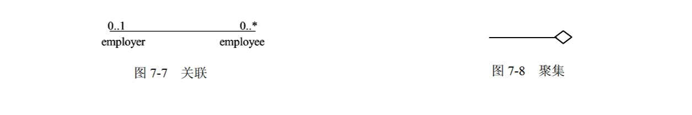
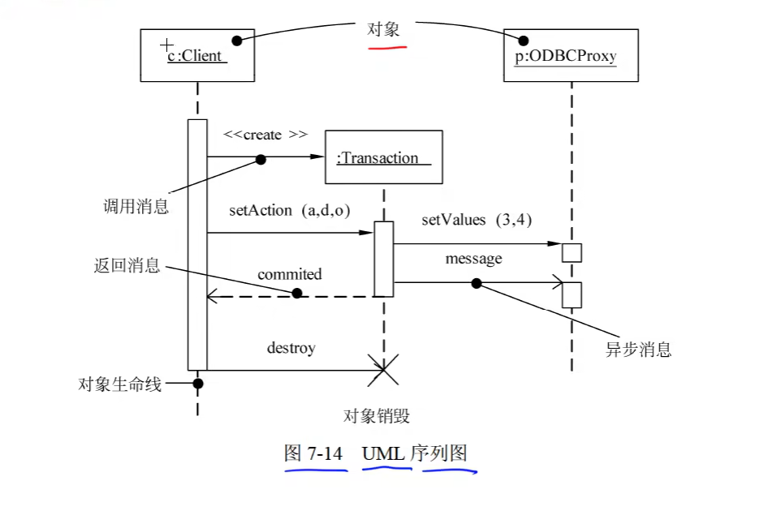
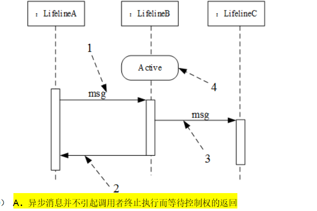

##  事物

UML中有4中事物：

1. 结构事物：结构事物是UML模型中的**名词**，通常是模型的**静态部分**，描述概念或物理元素。

> 静态

2. 行为事物：行为事物是UML模型的**动态部分**，它们是模型中的**动词**，描述了跨越时间和空间的行为。

> 动态、交互

3. 分组事物：分组事物是UML模型的**组织部分**，是一些由模型分解成“盒子”。

> 组织、包

4. 注释事物：注释事物是UML模型的解释部分。这些注释事物用来描述、说明和标注模型的任何元素。

总结：

#### 事物

- 结构事物。结构事物是UML模型中的名词。它通常是模型的静态部分
- 行为事物。行为事物是UML模型的动态部分。
- 分组事物。分组事物是UML模型的组织部分，是一些由模型分解成的“盒子”。
- 注释事物。注释事物是UML模型的解释部分。这些注释事物用来描述、说明和标注模型的任何元素。

## 关系

UML中有4种关系：依赖、关联、泛化和实现。

1. 依赖：依赖是两个事物间的**语义关系**，其中一个事物（独立事物）发生变化会影响另一个事物（依赖事物）的语义。

> 依赖是偶然、临时的

> A依赖B，B变化A会有影响

2.  关联：关联是一种**结构关系**，它描述了一组链，链是对象之间的连接

   > 关联的关系更强，例如人—氧气
   >
   > 
   >
   > 

   - 聚合：部分和整体的生命周期不一致，整体消失了，部分仍然存在，部分可以脱离整体存在。 

     

   -  组合：部分和整体的生命周期一致，整体消失了，部分也消失了，部分不可以脱离整体存在

3. 泛化：泛化是一种特殊/一般关系，特殊元素（子元素）的对象可替代一般元素（父元素）的对象。子元素共享了父元素的结构和行为。

   ​	 

4. 实现（了解）：实现是类元之间的语义关系，其中一个类元指定了由另一个类元保证执行的契约。

   

总结：

#### 关系

- 依赖
- 关联
  - 聚合
  - 组合
- 泛化
- 实现

## UML图

###  类图

类图（Class Diagram）展现了一组**对象、接口、协作**和它们之间的关系。

> 静态

符号：

`+` : public 公有的

`-`  : private 私有的

`#` : protected 受保护的

`~` : package 包的

类图用于对系统的**静态设计视图建模**。通常以下述3种方式之一使用类图：

1. 对系统的词汇建模。
2. 对简单的协作建模。
3. 对逻辑数据库模式建模。

### 对象图

对象图展现了**某一时刻一组对象以及它们之间的关系**，描述了在类图中所建立的事物的实例的**静态快照**。

对象图给出系统的**静态设计视图**或**静态进程视图**。

> 静态\\
>
> 对象名：类名
>
> 属性：值

### 用例图

- **用例图展现了一组用例、参与者以及它们之间的关系。**

> 包括：用例、参与者、用例之间扩展关系和包含关系、参与者和用例之间关联关系、用例和用例及参与者与参与者的泛化关系

- 一个用例执行的时候，可能会发生一些特殊的情况或可选的情况，这种情况就是这个用例的扩展用例。

- 参与者：参与者是与系统交互的**外部实体**。可能是使用者，也可能是与系统交互的外部系统、基础设备等。

- 用例：用例是从用户角度描述系统的行为，它将系统的一个功能描述成**一系列的事件**，这些事件最终对操作者产生有价值的观测结果。用例是一个类，它代表一类功能而不是使用该功能的某一具体实例。

- 之间的关系：

  - 包含关系(<<include>>)（用例之间）：一个用例包含另一个用例
  - 扩展关系(<<extend>>)（用例之间）：一个用例执行的时候，可能会发生一些特殊的情况或可选的情况，这种情况就是这个用例的扩展用例
  - 关联关系（参与者和用例之间）
  - 泛化关系（用例与用例以及参与者与参与者之间）

  

- 用例图用于对系统的**静态用例视图**进行建模。可用以下两种方式来使用用例图：
  - 对系统的语境建模。
  - 对系统的需求建模。

> 国际学生是子类（与学生是泛化关系）

### 交互图（序列图、通信图）

- 交互图用于对系统的**动态方面**进行建模。一张交互图表现的是一个交互，由一组对象和它们之间的关系组成。包含它们之间可能传递的消息。
- 交互图一般包括对象、链和消息

1. **序列图**（顺序图、时序图） ：序列图是场景的图形化表示，描述了对象之间的时间顺序。

   序列图用于展示系统中一个用例和多个对象的行为。

   > 消息是实线箭头
   >
   > 返回消息是虚线箭头

   序列图有两个不同于通信图的特征： 

   - 序列图有对象生命线

   - 序列图有控制焦点

     

2.  **通信图**（协作图）：通信图强调**收发消息的对象的结构组织**，在早期的版本中也被称作协作图。

   **通信图展现了对象之间的消息流及其顺序。**

   通信图有两个不同于序列图的特性： 

   - 通信图有路径
   - 通信图有顺序号

   

### 状态图

> 动态

- 状态图展现了一个**状态机**，它由状态、转换、事件和活动组成。
- 状态图展现了对象的状态转换及事件顺序
- 可以用状态图对系统的**动态方面**建模。当对系统、类或用例的动态方面建模时，通常是对**反应型对象建模**。
- 定义的状态主要有：初态（即初始状态）、终态（即最终状态）和中间状态。

> 初态：实黑圆心 、终态：实黑圆心+环、中间状态：圆角矩形（包括状态名和活动表）

- 三种标准事件：entry、exit、do

  - entry：入口动作，进入状态立即执行

  - exit：出口动作，退出状态立即执行

  - do：内部活动，占有限时间，并可以中断的工作
- 事件是在某个特定时刻发生的事情，它是对引起系统做动作或（和）从一个状态转换到另一个状态的外界事件的抽象。
- 转换包括两个状态（源状态，目标状态）、事件，监护条件，动作

**事件触发转换（迁移)**

活动（动作）可以在状态（迁移）内执行，也可以在状态转换时执行。

监护条件是一个布尔表达式。

### 活动图

> 动态、没有事件

- 活动图是一种特殊的状态图，它展现了在系统内从**一个活动到另一个活动的流程**。

- 活动图一般包括活动状态和动作状态、转换和对象。

- 通常有两种使用活动图的方式:

  - 对工作流建模。
  - 对操作建模。	

### 构件图（组件图） 

- **构件图展现了一组构件之间的组织和依赖。**
- 构件图专注于系统的静态**实现**试图。

### 部署图

- 部署图是用来对面向对象系统的**物理方面**建模的方法，展现了运行时处理结点以及其中构件（制品）的配置。
- **部署图展现了系统的软件和硬件之间的关系，在实施阶段使用。**

#### UML图汇总

- 静态建模：类图、对象图、用例图
- 动态建模：序列图（顺序图、时序图）、通信图（协作图）、状态图、活动图
- 物理建模：构件图（组件图）、部署图
- 交互图：序列图（顺序图、时序图）、通信图（协作图）

## 题目

### 关系错题

- 商品可以脱离购物车存在
- 但是商品不能脱离网点单独存在

### 多重度错题

### 类图

第一题：

解析：医生和病人之间的组合不唯一

第二题：

A是抽象类，没有直接对象

### 序列图

- 序列图由一组对象及其之间的关系组成

### 通信图

### 状态图

1. 状态图用于描述对象、子系统、系统的生命周期。通过状态图可以来了解到一个对象所能到达的所有状态，以及对象收到的事件，对对象状态的影响。

> 不可以用来描述多个对象之间的交互
>
> 可以用于描述一个对象在多个实例中的行为

2. ON是一个超状态，它有三个子状态：idle、rewinding、playing

3. 若事件触发一个没有特定监护条件的迁移（转换），则对象离开当前状态
4. 状态图对**反应型对象建模**
5. tries++是转换

### 杂题

1. 
2. 

> msg1是同步消息：需要接收者有回应
>
> msg2是返回消息
>
> msg3是异步消息

3. UML中接口可用于：**声明对象类所需要的服务**

> <<interface>>表示接口这个概念，声明对象所需要的服务，服务具体如何执行由实现它的具体类完成

 

4. 部署图：部署组件之间的依赖关系类似于包依赖

